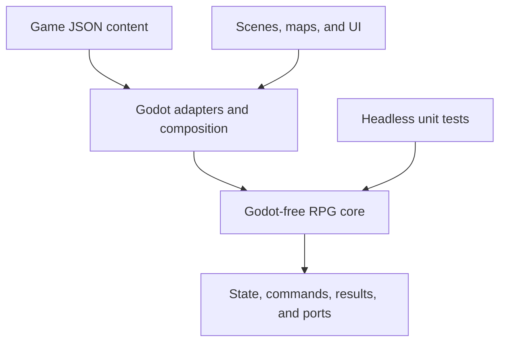

# Architecture

## Purpose

This structure supports one original JRPG that can grow to hundreds of maps and
content records without turning scenes into global state or mixing combat math with
presentation. The reusable portion is deliberately a game-focused core library, not
a general engine intended to satisfy unrelated RPGs.

## Dependency direction



Dependencies point inward. `RpgGame.Core` knows nothing about nodes, resources,
controls, animation, input devices, file locations, or scene transitions.

## Repository layout

```text
.
├── game/
│   ├── assets/                 # Game-specific audio, fonts, and sprites
│   ├── content/                # One JSON record per file, grouped by category
│   ├── localization/           # Translation catalogs
│   ├── maps/                   # Tile maps and map-owned scene resources
│   └── scenes/                 # Bootstrap and feature presentation scenes
├── src/
│   ├── Rpg.Core/               # Pure .NET definitions, state, rules, and ports
│   │   ├── Combat/
│   │   ├── Content/
│   │   ├── Persistence/
│   │   └── State/
│   └── Rpg.Game/               # Godot nodes, adapters, and composition root
│       ├── Adapters/
│       └── Bootstrap/
├── tests/
│   └── RpgGame.Core.Tests/     # Fast nonvisual tests
├── tools/
│   └── content-validation/     # Reserved for the content linter milestone
├── project.godot
├── RpgGame.csproj              # Godot C# assembly
└── RpgGame.sln
```

As features arrive, add cohesive core folders such as `Inventory`, `Quests`, and
`Dialogue`. Do not pre-create a framework hierarchy for systems that do not exist.

## Runtime ownership

There are three kinds of data and they must remain distinct:

| Kind | Example | Owner | Lifetime |
|---|---|---|---|
| Definition | `ability.black-magic.fire` | Immutable content catalog | Application |
| Runtime state | Current HP during battle | Core feature/session | Encounter or session |
| Presentation state | Selected menu row | Godot scene/control | Scene |

The future `GameSession` implementation owns the active `GameState` across scene
changes. A map scene reads the location it needs and submits state changes through an
application use case; it does not become the source of truth. Battle scenes receive a
battle snapshot and can be destroyed and reconstructed without losing campaign state.

## Narrow application services

Only services whose lifetime genuinely spans scenes may be composed at `GameRoot`.
Expected examples are:

- `IContentCatalog`: immutable, validated content lookup after startup;
- `IGameSession`: owns the current scene-independent campaign state;
- a save coordinator using `ISaveStore`: migration, serialization, and atomic storage;
- a scene navigator, once more than one real transition exists.

These are injected into entry scene controllers. They are not exposed through a
general `Globals` object. No autoload is configured yet; service lifetime and access
will be introduced with the feature that needs it.

## System communication

Use the least broad mechanism that crosses the required boundary:

- direct method calls inside one cohesive feature;
- C# interfaces for core-to-platform ports and major system boundaries;
- typed C# domain events/results for outcomes from pure rules;
- Godot signals from scene presentation to its parent/coordinator.

Signals should describe completed user or presentation actions, such as
`AbilityChosen`, not provide an untyped global message bus. Coordinators translate
between Godot signals and core commands.

## Content architecture

The future content adapter will recursively read category folders, deserialize JSON
into the definitions in `RpgGame.Core.Content.Definitions`, and build typed read-only
indexes. Startup validation must reject duplicate IDs, malformed IDs, invalid ranges,
missing references, and references to the wrong category.

JSON was selected over Godot `Resource` subclasses because definitions remain usable
in headless tests and tools, diffs stay readable, and data does not acquire engine
lifetime or import concerns. Godot resources remain appropriate for presentation
assets and authored scenes.

Files are an authoring detail. Runtime and save data only store stable IDs. Content
loading and validation are intentionally deferred; the current records define the
boundary without pretending the pipeline is already implemented.

## Combat boundary

`ICombatResolver` accepts a `CombatSnapshot` plus a `CombatCommand` and returns the
next snapshot plus typed `CombatEvent` values. A future resolver will depend on
content, explicit rules, and an injected `IRandomSource`; it will not depend on Godot.

The battle scene will:

1. convert player or AI intent into a command;
2. ask the resolver for an outcome;
3. play the returned events in order;
4. render the returned state.

This makes damage formulas, targeting, status interactions, and AI decisions testable
without rendering a frame. It also prevents animation timing from changing results.
Concrete event types are deferred until the combat slice proves which events are
actually needed.

## Save and load

`SaveEnvelope` separates the file format version from the internal state schema. Save
JSON uses named fields and stable content IDs—never scene paths, node references,
indexes, or serialized Godot objects.

Compatibility policy:

- new fields are optional and receive safe defaults;
- removed or renamed fields require ordered `ISaveMigration` implementations;
- migrations operate on JSON before strongly typed deserialization;
- unknown fields are retained through `JsonExtensionData` where practical;
- released migrations are immutable and tested with fixture saves;
- saving eventually uses a temporary file, validation, atomic replacement, and a
  last-known-good backup.

The game version is diagnostic. `SaveFormatVersion`, not the executable version,
decides whether migration is necessary.

## Testing strategy

The test pyramid is intentionally weighted toward fast, headless tests:

1. **Core unit tests:** formulas, turn ordering, targeting, status effects, inventory
   rules, quest transitions, and deterministic seeded scenarios.
2. **Content contract tests:** deserialize all JSON and validate IDs, references,
   ranges, and uniqueness. These become a command-line/CI gate.
3. **Save compatibility tests:** load historical fixtures, migrate, assert meaning,
   save again, and reload.
4. **Godot smoke tests:** a small number of headless tests for scene wiring and signal
   connections after presentation exists.
5. **Manual playtests:** feel, pacing, visual timing, controller navigation, and map
   correctness—areas where unit tests provide little value.

`RpgGame.Core.Tests` currently demonstrates stable-ID and unknown-save-field tests.

## Decisions intentionally deferred

- final damage and progression formulas;
- status-effect stacking and timing;
- dialogue/cutscene authoring format;
- map transition and encounter triggering details;
- inventory stacking and equipment slot rules;
- AI planning model;
- final save-slot UI and platform paths;
- content hot reload and custom editor tooling.

Each should be decided against a playable use case rather than a speculative engine.

## Major risks and mitigations

| Risk | Why it matters | Mitigation |
|---|---|---|
| Engine/SDK mismatch | The Godot .NET editor and `Godot.NET.Sdk` package must remain compatible. | Pin both to 4.7.x, upgrade deliberately, and run a headless import after upgrades. |
| ID or schema churn | Renamed content can silently break saves and cross-references. | Treat released IDs as permanent; validate all references; require explicit migrations. |
| `rulesetId` becomes a scripting language | An open-ended parameter bag can become difficult to understand and validate. | Keep a small code-owned registry, document parameters per ruleset, and add only proven families. |
| Scene coupling returns through convenience | Direct node searches and scene-owned state make transitions and tests fragile. | Compose narrow services at `GameRoot`; keep campaign truth in `GameState`; use owned signals. |
| Save DTOs mirror runtime objects too closely | Refactors could become accidental file-format breaks. | Keep named, simple DTO fields; migrate JSON at the boundary; test historical fixtures. |
| Hundreds of JSON files become tedious | Manual errors and bulk tuning can overwhelm one developer. | Build validation first; add focused search/bulk-edit tooling only after real authoring pain appears. |
| Premature framework work consumes the project | A solo project can stall before it becomes playable. | Gate abstractions against the next vertical slice and the explicit roadmap deferrals. |
| Platform choice arrives late | C# export support and platform requirements can constrain release targets. | Select and smoke-test the intended desktop/mobile targets before production content ramps up. |
