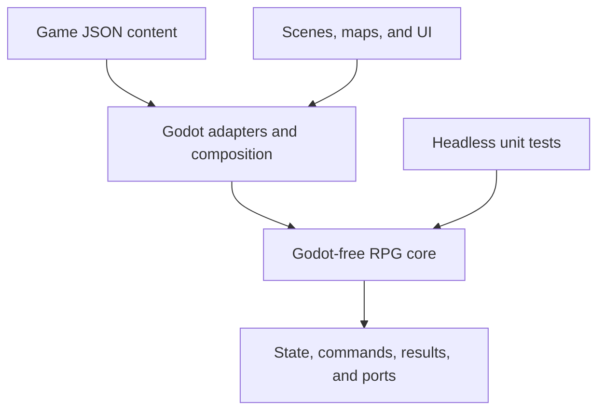
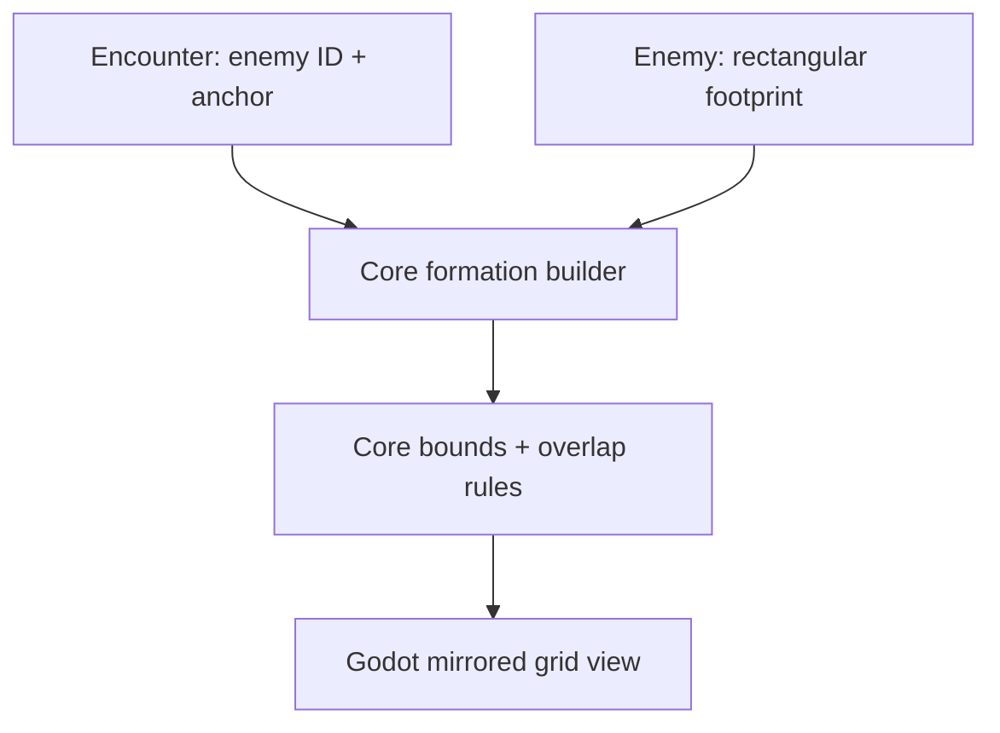
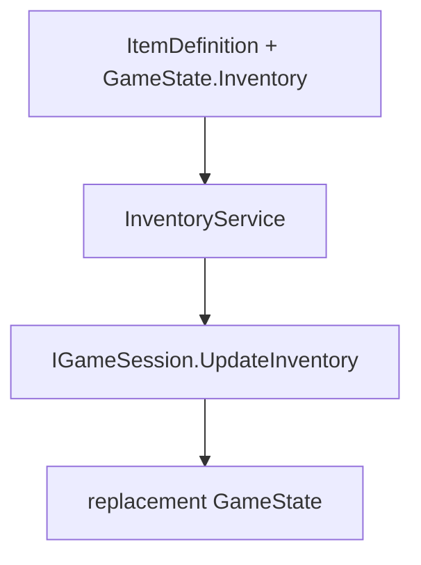
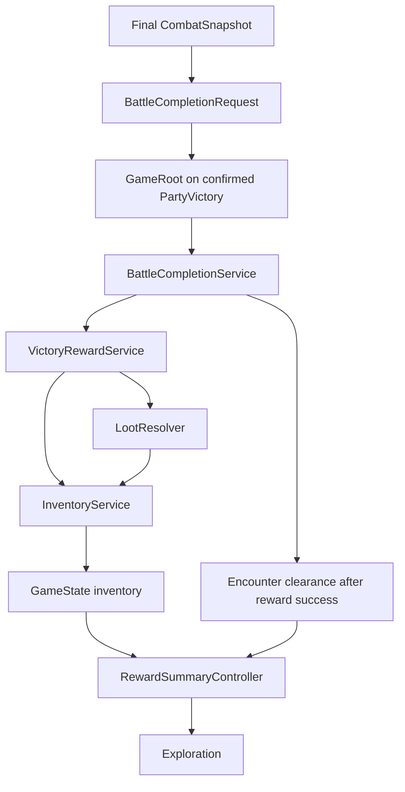
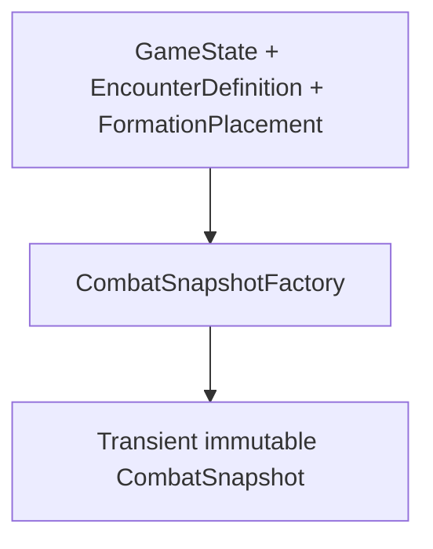
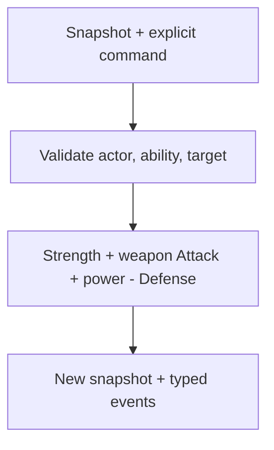
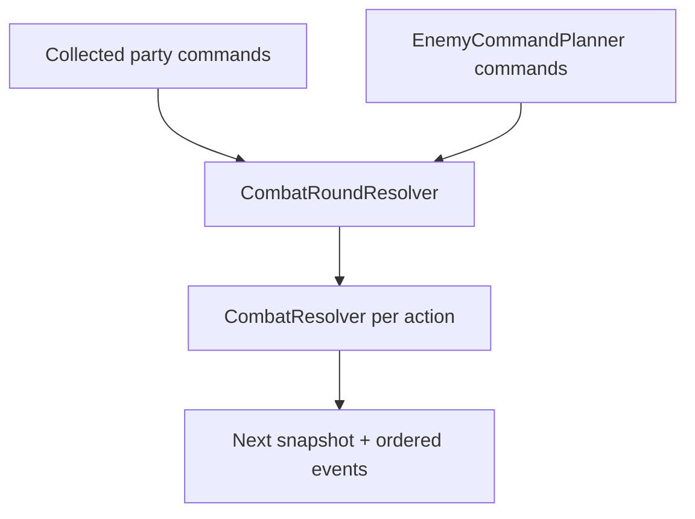
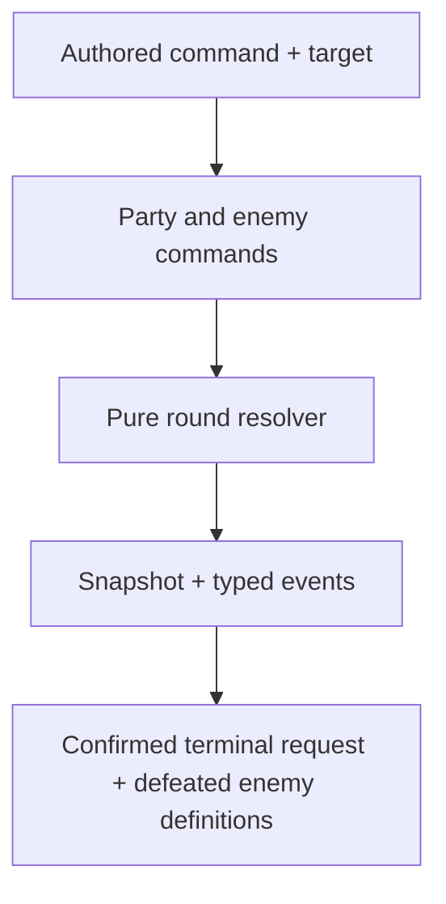

# Architecture

## Purpose

This structure supports one original JRPG that can grow to hundreds of maps and
content records without turning scenes into global state or mixing combat math with
presentation. The reusable portion is deliberately a game-focused core library, not
a general engine intended to satisfy unrelated RPGs.

## Dependency direction



Dependencies point inward. `RpgGame.Core` knows nothing about nodes, resources,
controls, animation, input devices, file locations, or scene transitions.

## Repository layout

```text
.
├── game/
│   ├── assets/                 # Game-specific audio, fonts, and sprites
│   ├── content/                # One JSON record per file, grouped by category
│   ├── localization/           # Translation catalogs
│   ├── maps/                   # Tile maps and map-owned scene resources
│   └── scenes/                 # Bootstrap and feature presentation scenes
├── src/
│   ├── Rpg.Core/               # Pure .NET definitions, state, rules, and ports
│   │   ├── Combat/
│   │   ├── Content/
│   │   ├── Mods/                   # Data-only manifests and compatibility
│   │   ├── Persistence/
│   │   └── State/
│   └── Rpg.Game/               # Godot nodes, adapters, and composition root
│       ├── Adapters/
│       └── Bootstrap/
├── tests/
│   └── RpgGame.Core.Tests/     # Fast nonvisual tests
├── examples/
│   └── mods/                    # Valid community package fixture
├── tools/
│   └── content-validation/     # Headless host for the production content loader
├── project.godot
├── RpgGame.csproj              # Godot C# assembly
└── RpgGame.sln
```

As features arrive, add cohesive core folders such as `Inventory`, `Quests`, and
`Dialogue`. Do not pre-create a framework hierarchy for systems that do not exist.

## Runtime ownership

There are three kinds of data and they must remain distinct:

| Kind | Example | Owner | Lifetime |
|---|---|---|---|
| Definition | `ability.black-magic.fire` | Immutable content catalog | Application |
| Runtime state | Current HP during battle | `CombatSnapshot` in the core | Encounter |
| Presentation state | Selected menu row | Godot scene/control | Scene |

`GameSession` owns the active `GameState` across scene
changes. A map scene reads the location it needs and submits state changes through an
application use case; it does not become the source of truth. Battle scenes receive a
battle snapshot and can be destroyed and reconstructed without losing campaign state.

### Exploration slice

Milestone 2 makes that ownership concrete. `ExplorationSceneController` receives
`IContentCatalog` and `IGameSession` from `GameRoot`; it never searches for an autoload or
global Node. The game-specific `TestRoomView` owns the fixed tile grid, pixel conversion, and
blocked tiles. Accepted moves call `IGameSession.UpdateLocation`, while the NPC interaction
calls `IGameSession.SetEventFlag`. Both mutations replace the current `GameState` snapshot and
raise `StateChanged`, allowing disposable views to reconstruct from authoritative data.

Milestone 2.1 injects one presentation-layer `IExplorationDevelopmentCommands` interface so
the test room can manually invoke quick-save and quick-load without knowing save directories
or locating `GameRoot`. Its K/L shortcuts always target `slot_1` and display development
feedback. They are temporary proof controls, not a permanent save-menu contract; persistent
state still flows exclusively through `GameSession` and `SaveCoordinator`.

The first room is drawn procedurally from colored rectangles because this milestone forbids
graphical assets and has only one real map. It is still a tile-based map: movement, walls,
occupancy, facing, and saved coordinates all use integer grid positions. A generalized map
loader, entry-point registry, and scene navigator wait for a second map to prove their shape.

### Fixed encounter handoff

Milestone 2.5 adds one direct, feature-specific transition without changing persistent-state
ownership. `TestRoomView` maps the walkable tile `(3, 4)` to the stable content ID
`encounter.forest.slimes-01`. After a successful step, `ExplorationSceneController` first
publishes James's destination and facing through `IGameSession.UpdateLocation`, then raises a
typed `EncounterLaunchRequest`. It never locates or replaces another Node itself.

`GameRoot` resolves that ID as an `EncounterDefinition` and builds its transient enemy/party
formations before removing exploration. Milestones 3.14 and 3.15 now extend the original
handoff: `GameRoot` constructs the initial `CombatSnapshot`, pure action/round resolvers, and
enemy planner, then injects them into `BattleController`. Milestone 4.2 extends the confirmed
victory path through atomic rewards and a disposable summary scene. The battle still receives
no `IGameSession`; it can report stable defeated enemy definitions and a typed terminal result
but cannot mutate campaign progress itself.

The trigger check exists only on the accepted-movement path, after the session update. Scene
construction, `StateChanged`, R reconstruction, quick-load, and battle return only apply
authoritative state to presentation. After defeat, James can return standing on the marker
without an immediate transition; stepping off and deliberately stepping back creates a retry.
After victory, rewards enter inventory before the persistent clearance flag is set. The room
then hides and ignores the marker after the player confirms the reward summary.

The three explicit presentations—exploration, battle, and reward summary—are not a general
navigator, scene stack, route registry, or transition state machine. A reusable map navigation
design still waits for a second actual map.

### Battle formation foundation

Milestone 2.75 first gave the placeholder a real logical battlefield without making it a combat
scene. Plain .NET types beneath `Rpg.Core/Combat/Formation` define a 4 × 4 enemy grid and a
4 × 2 party grid. On both sides, rows increase downward and side-relative column `0` means
front. `FormationSlotId` is the single parser/formatter for canonical encounter anchors;
`BattleFormationRules` enumerates rectangular footprints and reports invalid dimensions,
bounds, duplicate instance IDs, and same-side overlap in deterministic order.

The ownership chain is intentionally narrow:



`EncounterFormationBuilder` preserves authored encounter order and assigns transient
`enemy-0`, `enemy-1`, and so on. `PartyFormationBuilder` reads the current ordered party and
temporarily places its members down party column `0`; it delegates the four-member maximum to
`PartyRules`. Neither result is written to `GameState`. There is no persistent front/back
choice yet. The later playable scene reuses these placements unchanged.

`BattleFormationView` receives only already built core placements. It owns pixel sizes,
mirrors the enemy and party columns so both front columns face each other, and draws each
multi-cell placement as one rectangle. It does not parse content IDs, repeat validation, or
infer logical size from graphics. This keeps future attack/target rules headless while leaving
all screen geometry in Godot.

### Party capacity

The game has one ordered party, stored in `ActivePartyActorIds`, with a hard maximum of four
heroes. `PartyRules` owns that number so future new-game, recruitment, party-menu, and combat
code do not each invent separate limits. Mods may add alternative hero definitions, but the
same four-person maximum applies to base and modded content.

There is intentionally no reserve roster or configurable party capacity. Those concepts can
be introduced later only if the actual game design needs them.

## Narrow application services

Only services whose lifetime genuinely spans scenes may be composed at `GameRoot`.
Expected examples are:

- `IContentCatalog`: immutable, validated content lookup after startup;
- `IGameSession`: owns the current scene-independent campaign state;
- a save coordinator using `ISaveStore`: migration, serialization, and atomic storage;
- one `IRandomSource` production adapter injected into confirmed reward resolution;
- a scene navigator, once multiple real maps/destinations prove what navigation must support.

`GameRoot` currently constructs these services and exposes narrow Milestone 1 methods
for new game, save, and load. Future entry scene controllers will receive the interfaces
they need. The services are not exposed through a general `Globals` object, and no autoload
is configured.

### Player input preferences

`InputBindingService` is an application-lifetime Godot adapter composed by `GameRoot`. It owns
the validated mapping from stable logical actions such as `game.move-up` to Godot keyboard
events and persists that mapping under `user://settings/controls.json`. Exploration consumes
`InputMap` actions and therefore has no knowledge of the player's concrete gameplay keys.

Control preferences are independent of `GameState`: loading another campaign must not change
the player's keyboard layout, and remapping controls must not dirty a save slot. They are also
not content or data-mod records. `ControlsPanel` receives the service directly from its owning
exploration scene and exposes only binding selection/reset behavior; no autoload, service
locator, or global input event bus was introduced.

The playable battle reuses `game.interact`, `game.menu`, and the four movement actions for
command confirmation, target cancellation, and target cycling. It asks `InputBindingService`
to format current bindings, so remapped controls work and the screen never duplicates concrete
key knowledge.

## System communication

Use the least broad mechanism that crosses the required boundary:

- direct method calls inside one cohesive feature;
- C# interfaces for core-to-platform ports and major system boundaries;
- typed C# domain events/results for outcomes from pure rules;
- Godot signals from scene presentation to its parent/coordinator.

Signals should describe completed user or presentation actions, such as
`AbilityChosen`, not provide an untyped global message bus. Coordinators translate
between Godot signals and core commands.

## Content architecture

The content pipeline recursively reads category folders, deserializes JSON into the
definitions in `RpgGame.Core.Content.Definitions`, and builds typed read-only indexes.
It aggregates parse, identity, range, and cross-reference problems in one pass. A catalog
is published only if the complete pack passes; gameplay never receives partial content.

Explicitly identified sources feed the same loader:

- `GodotContentSource` reads built-in `res://game/content` through Godot's virtual filesystem;
- `DirectoryContentSource` reads ordinary files for tests, tools, and loose folders beneath
  the platform-specific `user://mods` directory.

This split isolates platform IO while ensuring the editor, tests, and CI all apply the
same deserialization and validation rules.

`ContentCategoryRegistry` is the single mechanical registration point for a category's folder,
definition type, stable-ID prefix, and currently supported schema version. It is an explicit
code-owned list, not runtime type scanning or a mod plugin hook. Category-specific semantic
rules remain in `ContentValidator`. This prevents a future content type from being added to one
loader switch while being forgotten by ID/reference validation, and lets one category evolve
without falsely changing every other record's version. JSON must explicitly include
`schemaVersion`; the default on the C# base record exists only for concise hand-built test/tool
definitions.

`DirectoryModDiscovery` validates one strict `manifest.json` per immediate mod folder,
checks its data-contract API version, verifies dependencies, and produces a deterministic
topological order. `GameRoot` loads base content first and each mod's `content/` folder in
that order. Validation remains all-or-nothing across the combined catalog.

The supported data API is `3`. API 2 replaced API 1's loosely documented encounter formation
keys with canonical grid coordinates. API 3 replaces embedded enemy `loot` arrays with typed,
reusable `loot-tables/` records and an enemy `lootTableId`; enemy records consequently use
schema version 2. These explicit compatibility gates reject old mod shapes instead of guessing
their meaning. Neither content-contract change alters `SaveFormatVersion`.

Milestone 2.8 keeps authored `EnemyFootprintDefinition` separate from transient formation
state. Its one `ToFormationFootprint` conversion copies validated rows and columns into the
pure core value; it does not infer size from a sprite or silently clamp author mistakes.
Because the DTO supplies `1` for both omitted members, existing base and data-mod enemy files
remained valid when that additive field was introduced. Enemy schema 2 retains the same
omission default; the later schema/API bump exists only for standalone loot ownership.

### Loot-table content boundary

Milestone 3.06 keeps enemy identity/combat tuning separate from reward authoring. An
`EnemyDefinition` stores one nullable stable `lootTableId`; a `LootTableDefinition` owns the
ordered independent item possibilities. Several enemies may share a table, and an empty table
is a legal deliberate no-award configuration. The production validator proves table and item
references, chance bounds, and inclusive positive quantity ranges before publishing the
catalog.

Milestone 4.1 supplies the promised pure-core `LootResolver`. It receives defeated enemy
definition IDs in explicit order, validated content, and an injected `IRandomSource`; it returns
one ordered `LootAward` for every independently successful entry. Duplicate item awards remain
separate facts. Milestone 4.2's `VictoryRewardService` is the campaign use case that applies
those facts after confirmed victory without changing resolver ownership.
The resolver never reads `GameState`, mutates inventory, aggregates stacks, or depends on Godot.
Content definitions themselves still never roll randomness or mutate campaign state.

The standalone table is useful for additive mods, but it deliberately does not create base
record replacement. A mod may add its own table and enemy or reference base/dependency content;
it may not redeclare a vanilla table ID. A future randomizer or vanilla-loot customization
feature needs an explicit deterministic profile/composition design rather than load-order wins.

### Persistent inventory boundary

Milestone 4.0 stores one campaign stack per stable `item.*` ID in `GameState.Inventory`.
Definitions remain immutable catalog data: `ItemDefinition.MaxStack` supplies the upper bound,
while the save stores only item IDs and positive owned quantities. An absent key means zero;
there are no duplicate stacks or saved slot indexes.



`InventoryService` is a plain-.NET, content-aware application service. Its ordered `AddItems`
batch combines repeated additions, validates every requested item and the whole current
inventory, applies checked stack rules to an ordinal copy, and publishes only one complete
valid replacement. `AddItem` delegates to that path; removal remains unchanged. `GameSession`
deliberately has no content catalog; its narrower responsibility is to copy positive key/value
pairs, suppress logically identical updates, preserve unrelated campaign fields, and raise
`StateChanged` once for a real inventory change.

The inventory field is additive and defaults to an empty ordinal dictionary, so saves that
predate Milestone 4.0 load without a migration or format-version increment. Normal JSON
serialization writes current stacks, and existing extension-data handling continues to retain
unknown future fields. Data-mod items use the same resolved catalog and stable-ID rules; the
mod data API and content schemas do not change.

### Victory reward application boundary

Milestone 4.2 connects confirmed battle completion to persistent inventory without moving
campaign or presentation concerns into loot resolution:



`BattleCompletionRequest.FromFinalSnapshot` carries defeated enemy definition IDs in combatant
order and preserves duplicates. `VictoryRewardService` calls the resolver once, retains raw
awards, builds first-occurrence item totals for presentation, and submits one atomic inventory
batch. `BattleCompletionService` bypasses rewards on defeat, rejects an already-cleared victory,
and sets clearance only after the batch succeeds. `GameRoot` repeats the cleared check as a
composition-level stale-request guard.

`SystemRandomSource` is created once at application lifetime and has no loot-specific policy.
The summary scene receives only immutable item totals and input bindings; it cannot reroll,
reapply, save, or mutate campaign state. Reward facts and summary presentation remain transient.
Only existing inventory and event-flag fields persist, so no save or content version changes.

### Mod composition boundary

Milestone 1.5 has no replacement or patch semantics. A mod owns only IDs under the namespace
derived from its manifest—for example, `mod.alex.weather-pack` may define
`ability.alex.weather-pack.storm`. Duplicate IDs remain errors. A mod may reference valid
base-game or dependency records through stable IDs. Installation order therefore cannot
silently decide which definition wins.

Starting-class availability is the one deliberate composition mechanism in this additive
model. `StartingClassRuleDefinition` records contribute included and excluded class IDs;
`StartingClassPool` computes the union of includes minus the union of excludes in ordinal
order. A mod can therefore add its own class or remove a vanilla choice without replacing a
base record. Exclusion always wins, which avoids an order-dependent conflict policy. James's
selected class belongs to per-save `ActorProgressState`, not `ActorDefinition`, so different
campaigns and future deterministic randomizers may choose different legal builds.

JSON was selected over Godot `Resource` subclasses because definitions remain usable
in headless tests and tools, diffs stay readable, and data does not acquire engine
lifetime or import concerns. Godot resources remain appropriate for presentation
assets and authored scenes.

Files are an authoring detail. Runtime and save data only store stable IDs. The current
fixture pack exercises the architecture; it is not intended to be production game content.

## Combat boundary

### Statistic resolution and initial combat state

Milestone 2.85 resolves complete immutable statistic dictionaries. Milestone 3.0 consumes
those unchanged results to construct one deterministic, transient snapshot:



Definitions remain application-lifetime content. `ActorProgressState` supplies the current
campaign class and level. `CombatStatisticResolver` combines actor bases with class bonuses or
resolves enemy-authored values, always including every registered statistic in ordinal ID
order. `CombatSnapshotFactory` copies those results; it never modifies their source records or
`GameState`.

Each `CombatantSnapshot` preserves its existing `FormationPlacement`, which remains the one
authority for battle-local instance ID, definition ID, side, anchor, and rectangular
footprint. The snapshot adds independently owned read-only statistics and ability IDs plus
current HP. Reusable runtime state accepts `0..MaximumHp`, where zero means defeated.
`CombatSnapshotFactory` owns the stricter initialization rule: starting current HP equals the
positive resolved `stat.max-hp`. Damage therefore replaces transient current HP without
rewriting maximum HP or authored content.

Party ability availability is actor `startingAbilityIds` followed by current-class unlocks at
or below the actor's level. Authored order is preserved and duplicates keep their first
occurrence. Milestone 3.05 splits the party projection into direct Skills, unlocked Magic
discipline containers, and a flat executable ability-ID list. A Magic ability is executable
only when the actor has learned that specific ability and has access to at least one of its
authored discipline IDs. The discipline itself is content and menu structure, not a command
ability ID.

The two structured collections—direct Skills and Magic discipline spell lists—are authoritative.
`PartyAbilityAvailability` derives its compatibility `ExecutableAbilityIds` view internally, so
a future caller cannot supply a flat list that disagrees with what the menu displays. The
resolver defensively validates all class unlock entries, including future-level entries, when
an editor/test catalog bypasses the production loader.

Ability target modes and rulesets are closed, code-owned contracts. Current JSON can select
`target.self` with `rules.defense.guard`, `target.enemy.single` with
`rules.damage.physical`, or `target.ally.single` with `rules.healing.flat`; each ruleset has an
exact required numeric-parameter shape and range. Unknown IDs and extra keys are errors rather
than dormant behavior. This validation does not execute an ability. `CombatResolver` owns both
physical damage and flat same-side healing state changes, while Godot remains responsible only
for presentation.

`AbilityDefinitionContractValidator` owns only that ability-specific semantic table and returns
path/code/message problems to the broader `ContentValidator`. It does not read files or resolve
cross-record references. This keeps future ruleset additions out of the already broad category
validator without introducing a general behavior framework.

Enemy abilities are copied in their authored order, and an empty enemy ability list is valid
initial state. Enemy discipline access and AI spellbook behavior are deferred, so an enemy's
authored ability IDs remain a flat executable list. Every included ID is resolved through
`IContentCatalog`.

The factory preserves supplied party order followed by supplied enemy order and starts the
snapshot at round one. It rejects wrong-side/category placements, duplicate battle-local IDs,
missing or duplicate actor progress, inactive party actors, missing abilities, and invalid
maximum HP rather than silently skipping or repairing a combatant.

This snapshot belongs only to a battle's lifetime. It is not added to `GameState`,
`SaveEnvelope`, or content JSON. Milestone 3.14 now gives the current snapshot to one disposable
Godot battle controller, but the controller replaces that snapshot only with core results and
never serializes it as campaign state.

### Single-action physical resolution

Milestone 3.10 implements the first narrow use of the reserved `ICombatResolver`,
`CombatCommand`, `CombatResolution`, and `CombatEvent` contracts. `CombatResolver` receives an
already validated `IContentCatalog`; it does not read files or discover behavior dynamically.
It accepts only a living combatant using an owned, affordable supported ability. The executable
contracts are `target.enemy.single` plus `rules.damage.physical` against one living opposing
combatant, and `target.ally.single` plus `rules.healing.flat` against one living same-side
combatant.



Physical damage uses decimal authored power and integer statistics. Intrinsic
`ability.command.attack` additionally receives its party combatant's equipped weapon Attack;
other physical abilities, enemy Tackle, magic, and healing do not. The formula takes a
minimum of one, applies the target snapshot's signed whole-percent modifier for the ability's
code-owned damage type, rounds the final decimal down explicitly, and clamps applied damage to
the target's remaining integer HP. `-100` is immunity; omitted types are neutral. Only the
target slot is replaced; round number, combatant order, formation, statistics, abilities,
damage affinities, unrelated HP, and the input snapshot are preserved. `DamageApplied` reports
the authoritative type, modifier, and before/after values so presentation never repeats the
calculation. `CombatantDefeated` reports one combatant reaching zero. Milestone 3.13 adds
a separate `BattleEnded` fact only when that defeat removes the final living member of a side.

Invalid runtime intent raises `CombatCommandValidationException` with a stable problem code
instead of requiring a caller to parse text. Malformed catalog/snapshot invariants remain data
errors. Milestone 4.5 maps only `stat.max-mp` cost content to the snapshot's separate mutable
current-MP pool, replaces that actor state atomically with the effect, and emits `ResourceSpent`
before the effect event. Other resource IDs remain rejected. Guard behavior, rewards, campaign
changes, and Godot presentation remain outside this resolver. Milestone 3.12 composes actions
into ordered rounds and Milestone 3.13 derives the battle-local outcome without moving those
responsibilities into presentation.

### Persistent equipment and basic weapon Attack

Milestone 4.8 stores each actor's equipped inventory item IDs in
`ActorProgressState.EquippedItems`, keyed by stable slot ID. `EquipmentService` resolves an
owned item to its one `EquipmentDefinition`, verifies the authored slot, and publishes a single
replacement actor-progress state through `IGameSession`. Equipping never removes an inventory
stack; clearing an empty slot is a no-op. The starter slice supports
`slot.weapon.main-hand` only. Older saves omit the additive map and deserialize as empty.

`CombatSnapshotFactory` copies the equipped main-hand weapon into transient `CombatantSnapshot`
fields (`EquippedWeaponAttack` and an optional single damage type). The combat resolver does not
read campaign state. For basic Attack only, base damage is:

```text
max(1, Strength + WeaponAttack + AbilityPower - Defense)
```

Weapon Attack is deliberately not a Strength modifier. Iron Sword has Attack 4 and no Strength
bonus. A single 100% weapon profile overrides Attack's authored damage type; no weapon retains
the authored/legacy type. Mixed weapon profiles are valid authoring data but are rejected at
battle construction until component splitting is explicitly designed.

Milestone 4.9 adds scene-owned `GameMenuPanel` and `EquipmentPanel` beneath exploration's
existing `CanvasLayer`. They receive the same injected catalog/session as exploration and
rebuild their presentation from a read-only `EquipmentMenuProjectionResolver` after session
updates. The panel calls `EquipmentService` for equip/unequip; it never writes dictionaries,
inventory, or combat values directly. Menu focus and selected slot are disposable UI state.

### Complete deterministic rounds

Milestone 3.12 composes the single-action resolver without moving its validation or damage
formula. The future battle UI will collect one ordinary `CombatCommand` for each living party
member. `EnemyCommandPlanner` supplies the same command type for each living enemy. Once every
living combatant has exactly one command, `CombatRoundResolver` orders and executes them.



Ordering uses resolved `stat.speed` descending, then battle-local instance ID ascending with
ordinal comparison. It never uses content file order, dictionary iteration, display names, or
Godot node order. Commands are collected from the starting snapshot, but each actor is reread
from the newest immutable snapshot before acting. A combatant defeated by a faster action is
skipped. Processing stops as soon as either `BattleSide` has no living combatants.

If both sides survive all planned actions, the returned snapshot advances from round `N` to
round `N + 1`. A terminal result retains round `N` because another round never begins. This
terminal query remains battle-local: Milestone 3.12 does not award loot, clear an encounter,
or write victory/defeat into `GameState`.

The basic enemy policy scans `EnemyDefinition.AbilityIds` in authored order, skips contracts or
costs the current resolver cannot execute, and uses the first usable ability. It selects the
living party target with the lowest absolute current HP, then breaks equal-HP ties by ordinal
instance ID. `CombatAbilityExecutionSupport` is the one small shared description used by both
the planner and action resolver, preventing AI from selecting a command the resolver does not
support without creating a ruleset registry or general AI framework.

Round coordination and planning remain pure .NET and transient. Milestone 3.14 consumes them
from Godot without moving their decisions into the scene and does not reintroduce Guard or
vanilla class abilities. See `MILESTONE_3_12_GUIDE.md`.

### Battle outcome

Milestone 3.13 makes the terminal query a closed core contract. `CombatSnapshot.Outcome`
derives `InProgress`, `PartyVictory`, or `PartyDefeat` from current immutable HP. It is not a
separately supplied constructor value, so an outcome cannot become stale when a resolver
replaces combatant state.

The single action that defeats a side returns events in causal order:

```text
DamageApplied
CombatantDefeated
BattleEnded
```

`CombatRoundResolver` carries those events forward unchanged and stops all remaining actions.
Both `CombatResolver` and `CombatRoundResolver` reject new commands after a terminal outcome;
callers therefore cannot create a second end event by resolving the terminal snapshot again.
A snapshot in which both sides are defeated is rejected as malformed state because the
current single-target rules cannot produce it and the requested three-value outcome has no
draw result.

Outcome remains encounter-lifetime data. `PartyVictory` does not itself grant items, roll a
loot table, clear an encounter, set a `GameState` flag, or save a battle. Milestones 3.15 and
4.2 add an explicit confirmed application handoff; the reusable combat rule still has no
campaign dependency. See `MILESTONE_3_13_GUIDE.md`.

### Playable battle presentation and campaign handoff

`BattleController` receives the initial snapshot, content catalog, command-availability
resolver, `ICombatRoundResolver`, and `IEnemyCommandPlanner`. It projects structured party
Skills and Magic-discipline submenus, displays HP/MP from snapshots, submits the selected
authored ability ID with its authored supported target route, and submits planner-produced
commands for each living slime. It renders `ResourceSpent`, `DamageApplied`, `HealingApplied`,
`CombatantDefeated`, and `BattleEnded`; it never repeats combat formulas, Speed ordering,
HP/MP mutation, or terminal-side query.



`GameRoot` owns the application transition. On confirmed `PartyVictory`, it maps the fixed
encounter to `flag.encounter.forest.slimes-01.cleared`, invokes the headless completion service,
and shows the already-applied reward totals. Inventory publication succeeds before the service
sets clearance. `PartyDefeat` intentionally resolves no loot and does not mutate the session.
`TestRoomView` receives the derived cleared boolean during every state application, so scene
reconstruction and quick-load both redraw and suppress the marker from `GameState`, never from
a remembered Node field.

The battle snapshot, raw awards, and reward-summary state are not saved. Inventory and clearance
use existing persistent fields, so the named-field save format needs no version change. There is
still one fixed encounter and no general encounter-progress schema or scene navigator. See
`MILESTONE_3_14_GUIDE.md`, `MILESTONE_3_15_GUIDE.md`, and `MILESTONE_4_2_GUIDE.md`.

## Save and load

`SaveEnvelope` separates the file format version from the internal state schema. Save
JSON uses named fields and stable content IDs—never scene paths, node references,
indexes, or serialized Godot objects.

Compatibility policy:

- new fields are optional and receive safe defaults;
- removed or renamed fields require ordered `ISaveMigration` implementations;
- migrations operate on JSON before strongly typed deserialization;
- unknown fields are retained through `JsonExtensionData` where practical;
- released migrations are immutable and tested with fixture saves;
- saving uses a temporary file in the destination directory, reads it back through the
  production serializer, atomically moves it over the primary file, and keeps the previous
  primary as a last-known-good `.bak` file.

The game version is diagnostic. `SaveFormatVersion`, not the executable version,
decides whether migration is necessary.

The save envelope also records the stable ID and exact authored version of every data mod
enabled when it was written. Loading requires those mods at the recorded versions and raises
typed compatibility errors when one is missing or different. This additive field defaults to
an empty list, so pre-mod saves remain readable. Extra currently installed mods are allowed
until a later mod-profile UI provides exact-set control.

## Testing strategy

The test pyramid is intentionally weighted toward fast, headless tests:

1. **Core unit tests:** formulas, turn ordering, targeting, status effects, inventory
   rules, quest transitions, and deterministic seeded scenarios.
2. **Content contract tests:** deserialize all JSON and validate IDs, references,
   ranges, and uniqueness. These become a command-line/CI gate.
3. **Save compatibility tests:** load historical fixtures, migrate, assert meaning,
   save again, and reload.
4. **Godot smoke tests:** a small number of headless tests for scene wiring and signal
   connections after presentation exists.
5. **Manual playtests:** feel, pacing, visual timing, controller navigation, and map
   correctness—areas where unit tests provide little value.

`RpgGame.Core.Tests` now covers stable IDs, complete-pack loading (including the fixed
encounter's formation), canonical slot parsing, rectangular occupied-cell ordering,
formation bounds/overlap, deterministic encounter and party placement, aggregated content
failures, mod manifests/namespaces/dependency ordering, modded-save compatibility,
new-game construction, exploration location/flag mutations, session notification, dialogue
content, save migrations, safe slot names, unknown future fields, and an actual filesystem
save/load round trip. Focused combat-statistic tests cover actor-plus-class and enemy formulas,
defaults, range failures, unknown IDs, ordinal enumeration, result immutability, and automatic
participation by a newly registered statistic. Milestone 3.0 adds focused tests for initial
identity/order, formation preservation, current HP, ability availability, defensive failures,
and independently owned read-only snapshot collections. Ability-framework tests additionally
cover Skill/Magic gating, multi-discipline projection, code-owned target/ruleset parameter
contracts, duplicate grants, required JSON schema versions, and defensive hand-built catalogs.
Loot-table content tests cover category-specific enemy schema versions, typed enemy/table/item
references, probability and quantity boundaries, null handling, legacy inline-shape rejection,
and namespaced mod tables without performing random rolls. Milestones 3.10 and 3.12 add
deterministic coverage for physical damage, immutable defeat state, complete command sets,
Speed/instance-ID order, defeated-actor skipping, terminal-side stopping, and the basic enemy
ability/target policy.

## Decisions intentionally deferred

- final damage and progression formulas;
- status-effect stacking and timing;
- dialogue choices, conditions, cutscene commands, and localization;
- general map transitions and random/scalable encounter triggering details;
- item use, equipment ownership, active equipment slots, and application of authored weapon
  damage profiles;
- advanced AI profiles, scoring, and authored behavior differences;
- final save-slot UI and platform paths;
- content hot reload and custom editor tooling;
- a mod enable/disable or profile UI;
- packaged PCK/ZIP mods, Steam Workshop, remote downloads, and signatures;
- community scripts, C# assemblies, native libraries, or a behavior scripting language;
- base-record replacement, patch merging, and conflict resolution.

Each should be decided against a playable use case rather than a speculative engine.

## Major risks and mitigations

| Risk | Why it matters | Mitigation |
|---|---|---|
| Engine/SDK mismatch | The Godot .NET editor and `Godot.NET.Sdk` package must remain compatible. | Pin both to 4.7.x, upgrade deliberately, and run a headless import after upgrades. |
| ID or schema churn | Renamed content can silently break saves and cross-references. | Treat released IDs as permanent; validate all references; require explicit migrations. |
| `rulesetId` becomes a scripting language | An open-ended parameter bag can become difficult to understand and validate. | Keep a small closed code-owned contract, reject unknown IDs/keys, document ranges per ruleset, and add only proven families. |
| Scene coupling returns through convenience | Direct node searches and scene-owned state make transitions and tests fragile. | Compose narrow services at `GameRoot`; keep campaign truth in `GameState`; use owned signals. |
| Save DTOs mirror runtime objects too closely | Refactors could become accidental file-format breaks. | Keep named, simple DTO fields; migrate JSON at the boundary; test historical fixtures. |
| Hundreds of JSON files become tedious | Manual errors and bulk tuning can overwhelm one developer. | Build validation first; add focused search/bulk-edit tooling only after real authoring pain appears. |
| Community packs conflict or corrupt saves | Ambiguous overrides and missing definitions can make state impossible to reconstruct. | Reserve a namespace per mod, reject overrides, dependency-order deterministically, and record required ID/version pairs in saves. |
| Mod support becomes arbitrary code execution | Loading community assemblies or scripts creates a much larger security and compatibility surface. | Milestone 1.5 accepts strict JSON records only; executable hooks remain explicitly unsupported. |
| Exported build omits raw JSON | `res://` directory results can differ after export, and non-resource files must be included in the PCK. | Add `*.json` to the export preset's non-resource include filter and smoke-test content startup in every release export. |
| Premature framework work consumes the project | A solo project can stall before it becomes playable. | Gate abstractions against the next vertical slice and the explicit roadmap deferrals. |
| Platform choice arrives late | C# export support and platform requirements can constrain release targets. | Select and smoke-test the intended desktop/mobile targets before production content ramps up. |
