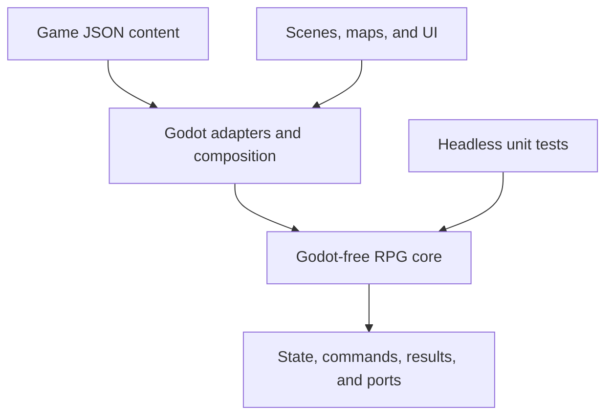
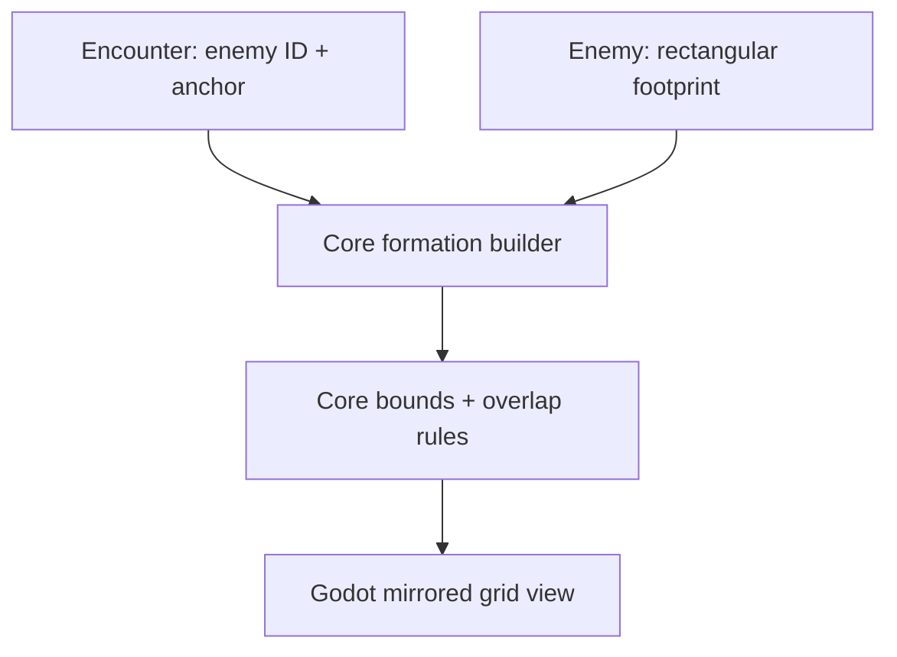
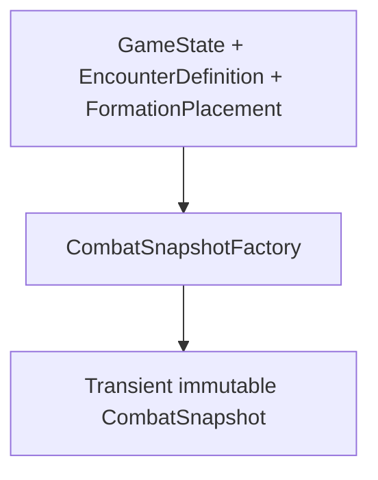

# Architecture

## Purpose

This structure supports one original JRPG that can grow to hundreds of maps and
content records without turning scenes into global state or mixing combat math with
presentation. The reusable portion is deliberately a game-focused core library, not
a general engine intended to satisfy unrelated RPGs.

## Dependency direction



Dependencies point inward. `RpgGame.Core` knows nothing about nodes, resources,
controls, animation, input devices, file locations, or scene transitions.

## Repository layout

```text
.
├── game/
│   ├── assets/                 # Game-specific audio, fonts, and sprites
│   ├── content/                # One JSON record per file, grouped by category
│   ├── localization/           # Translation catalogs
│   ├── maps/                   # Tile maps and map-owned scene resources
│   └── scenes/                 # Bootstrap and feature presentation scenes
├── src/
│   ├── Rpg.Core/               # Pure .NET definitions, state, rules, and ports
│   │   ├── Combat/
│   │   ├── Content/
│   │   ├── Mods/                   # Data-only manifests and compatibility
│   │   ├── Persistence/
│   │   └── State/
│   └── Rpg.Game/               # Godot nodes, adapters, and composition root
│       ├── Adapters/
│       └── Bootstrap/
├── tests/
│   └── RpgGame.Core.Tests/     # Fast nonvisual tests
├── examples/
│   └── mods/                    # Valid community package fixture
├── tools/
│   └── content-validation/     # Headless host for the production content loader
├── project.godot
├── RpgGame.csproj              # Godot C# assembly
└── RpgGame.sln
```

As features arrive, add cohesive core folders such as `Inventory`, `Quests`, and
`Dialogue`. Do not pre-create a framework hierarchy for systems that do not exist.

## Runtime ownership

There are three kinds of data and they must remain distinct:

| Kind | Example | Owner | Lifetime |
|---|---|---|---|
| Definition | `ability.black-magic.fire` | Immutable content catalog | Application |
| Runtime state | Current HP during battle | `CombatSnapshot` in the core | Encounter |
| Presentation state | Selected menu row | Godot scene/control | Scene |

`GameSession` owns the active `GameState` across scene
changes. A map scene reads the location it needs and submits state changes through an
application use case; it does not become the source of truth. Battle scenes receive a
battle snapshot and can be destroyed and reconstructed without losing campaign state.

### Exploration slice

Milestone 2 makes that ownership concrete. `ExplorationSceneController` receives
`IContentCatalog` and `IGameSession` from `GameRoot`; it never searches for an autoload or
global Node. The game-specific `TestRoomView` owns the fixed tile grid, pixel conversion, and
blocked tiles. Accepted moves call `IGameSession.UpdateLocation`, while the NPC interaction
calls `IGameSession.SetEventFlag`. Both mutations replace the current `GameState` snapshot and
raise `StateChanged`, allowing disposable views to reconstruct from authoritative data.

Milestone 2.1 injects one presentation-layer `IExplorationDevelopmentCommands` interface so
the test room can manually invoke quick-save and quick-load without knowing save directories
or locating `GameRoot`. Its K/L shortcuts always target `slot_1` and display development
feedback. They are temporary proof controls, not a permanent save-menu contract; persistent
state still flows exclusively through `GameSession` and `SaveCoordinator`.

The first room is drawn procedurally from colored rectangles because this milestone forbids
graphical assets and has only one real map. It is still a tile-based map: movement, walls,
occupancy, facing, and saved coordinates all use integer grid positions. A generalized map
loader, entry-point registry, and scene navigator wait for a second map to prove their shape.

### Fixed encounter handoff

Milestone 2.5 adds one direct, feature-specific transition without changing persistent-state
ownership. `TestRoomView` maps the walkable tile `(3, 4)` to the stable content ID
`encounter.forest.slimes-01`. After a successful step, `ExplorationSceneController` first
publishes James's destination and facing through `IGameSession.UpdateLocation`, then raises a
typed `EncounterLaunchRequest`. It never locates or replaces another Node itself.

`GameRoot` resolves that ID as an `EncounterDefinition` and builds its transient enemy/party
formations before removing exploration. It then shows `BattlePlaceholderController`, which
receives the definition, placements, and existing input-binding service but deliberately
receives no `IGameSession`; the placeholder can display the formation and request a return,
but it cannot mutate campaign progress. A typed return
request makes `GameRoot` instantiate a fresh test room with the same content, session,
development commands, and controls. The new room reconstructs location and flags solely from
`Session.Current`.

The trigger check exists only on the accepted-movement path, after the session update. Scene
construction, `StateChanged`, R reconstruction, quick-load, and placeholder return only apply
authoritative state to presentation. Consequently James can return standing on the marker
without an immediate second transition; stepping off and deliberately stepping back on creates
a new movement edge and requests it again. There is no saved current/pending encounter and no
cleared flag because this milestone has no battle outcome.

These two private composition methods—show exploration and show the battle placeholder—are not
a general navigator, scene stack, route registry, or transition state machine. A reusable map
navigation design still waits for a second actual map.

### Battle formation foundation

Milestone 2.75 gives the placeholder a real logical battlefield without making it a combat
scene. Plain .NET types beneath `Rpg.Core/Combat/Formation` define a 4 × 4 enemy grid and a
4 × 2 party grid. On both sides, rows increase downward and side-relative column `0` means
front. `FormationSlotId` is the single parser/formatter for canonical encounter anchors;
`BattleFormationRules` enumerates rectangular footprints and reports invalid dimensions,
bounds, duplicate instance IDs, and same-side overlap in deterministic order.

The ownership chain is intentionally narrow:



`EncounterFormationBuilder` preserves authored encounter order and assigns transient
`enemy-0`, `enemy-1`, and so on. `PartyFormationBuilder` reads the current ordered party and
temporarily places its members down party column `0`; it delegates the four-member maximum to
`PartyRules`. Neither result is written to `GameState`. There is no persistent front/back
choice yet, and entering or leaving the placeholder still cannot change campaign state.

`BattleFormationView` receives only already built core placements. It owns pixel sizes,
mirrors the enemy and party columns so both front columns face each other, and draws each
multi-cell placement as one rectangle. It does not parse content IDs, repeat validation, or
infer logical size from graphics. This keeps future attack/target rules headless while leaving
all screen geometry in Godot.

### Party capacity

The game has one ordered party, stored in `ActivePartyActorIds`, with a hard maximum of four
heroes. `PartyRules` owns that number so future new-game, recruitment, party-menu, and combat
code do not each invent separate limits. Mods may add alternative hero definitions, but the
same four-person maximum applies to base and modded content.

There is intentionally no reserve roster or configurable party capacity. Those concepts can
be introduced later only if the actual game design needs them.

## Narrow application services

Only services whose lifetime genuinely spans scenes may be composed at `GameRoot`.
Expected examples are:

- `IContentCatalog`: immutable, validated content lookup after startup;
- `IGameSession`: owns the current scene-independent campaign state;
- a save coordinator using `ISaveStore`: migration, serialization, and atomic storage;
- a scene navigator, once multiple real maps/destinations prove what navigation must support.

`GameRoot` currently constructs these services and exposes narrow Milestone 1 methods
for new game, save, and load. Future entry scene controllers will receive the interfaces
they need. The services are not exposed through a general `Globals` object, and no autoload
is configured.

### Player input preferences

`InputBindingService` is an application-lifetime Godot adapter composed by `GameRoot`. It owns
the validated mapping from stable logical actions such as `game.move-up` to Godot keyboard
events and persists that mapping under `user://settings/controls.json`. Exploration consumes
`InputMap` actions and therefore has no knowledge of the player's concrete gameplay keys.

Control preferences are independent of `GameState`: loading another campaign must not change
the player's keyboard layout, and remapping controls must not dirty a save slot. They are also
not content or data-mod records. `ControlsPanel` receives the service directly from its owning
exploration scene and exposes only binding selection/reset behavior; no autoload, service
locator, or global input event bus was introduced.

The battle-formation placeholder reuses the same `game.interact` and `game.menu` actions to return. It
asks `InputBindingService` to format the current bindings, so remapped controls work and the
screen never duplicates default-key knowledge.

## System communication

Use the least broad mechanism that crosses the required boundary:

- direct method calls inside one cohesive feature;
- C# interfaces for core-to-platform ports and major system boundaries;
- typed C# domain events/results for outcomes from pure rules;
- Godot signals from scene presentation to its parent/coordinator.

Signals should describe completed user or presentation actions, such as
`AbilityChosen`, not provide an untyped global message bus. Coordinators translate
between Godot signals and core commands.

## Content architecture

The content pipeline recursively reads category folders, deserializes JSON into the
definitions in `RpgGame.Core.Content.Definitions`, and builds typed read-only indexes.
It aggregates parse, identity, range, and cross-reference problems in one pass. A catalog
is published only if the complete pack passes; gameplay never receives partial content.

Explicitly identified sources feed the same loader:

- `GodotContentSource` reads built-in `res://game/content` through Godot's virtual filesystem;
- `DirectoryContentSource` reads ordinary files for tests, tools, and loose folders beneath
  the platform-specific `user://mods` directory.

This split isolates platform IO while ensuring the editor, tests, and CI all apply the
same deserialization and validation rules.

`DirectoryModDiscovery` validates one strict `manifest.json` per immediate mod folder,
checks its data-contract API version, verifies dependencies, and produces a deterministic
topological order. `GameRoot` loads base content first and each mod's `content/` folder in
that order. Validation remains all-or-nothing across the combined catalog.

The supported data API is `2`. It changed from `1` when encounter formation slots moved from
loosely documented `formation.*` keys to canonical grid coordinates. This deliberately rejects
old encounter mods instead of guessing what `formation.left` meant. The additive enemy
footprint still defaults to `1 × 1`, and neither change alters `SaveFormatVersion`.

Milestone 2.8 keeps authored `EnemyFootprintDefinition` separate from transient formation
state. Its one `ToFormationFootprint` conversion copies validated rows and columns into the
pure core value; it does not infer size from a sprite or silently clamp author mistakes.
Because the DTO supplies `1` for both omitted members, existing base and data-mod enemy files
remain valid without a schema, data-API, or save-format increment.

Milestone 1.5 has no replacement or patch semantics. A mod owns only IDs under the namespace
derived from its manifest—for example, `mod.alex.weather-pack` may define
`ability.alex.weather-pack.storm`. Duplicate IDs remain errors. A mod may reference valid
base-game or dependency records through stable IDs. Installation order therefore cannot
silently decide which definition wins.

Starting-class availability is the one deliberate composition mechanism in this additive
model. `StartingClassRuleDefinition` records contribute included and excluded class IDs;
`StartingClassPool` computes the union of includes minus the union of excludes in ordinal
order. A mod can therefore add its own class or remove a vanilla choice without replacing a
base record. Exclusion always wins, which avoids an order-dependent conflict policy. James's
selected class belongs to per-save `ActorProgressState`, not `ActorDefinition`, so different
campaigns and future deterministic randomizers may choose different legal builds.

JSON was selected over Godot `Resource` subclasses because definitions remain usable
in headless tests and tools, diffs stay readable, and data does not acquire engine
lifetime or import concerns. Godot resources remain appropriate for presentation
assets and authored scenes.

Files are an authoring detail. Runtime and save data only store stable IDs. The current
fixture pack exercises the architecture; it is not intended to be production game content.

## Combat boundary

### Statistic resolution and initial combat state

Milestone 2.85 resolves complete immutable statistic dictionaries. Milestone 3.0 consumes
those unchanged results to construct one deterministic, transient snapshot:



Definitions remain application-lifetime content. `ActorProgressState` supplies the current
campaign class and level. `CombatStatisticResolver` combines actor bases with class bonuses or
resolves enemy-authored values, always including every registered statistic in ordinal ID
order. `CombatSnapshotFactory` copies those results; it never modifies their source records or
`GameState`.

Each `CombatantSnapshot` preserves its existing `FormationPlacement`, which remains the one
authority for battle-local instance ID, definition ID, side, anchor, and rectangular
footprint. The snapshot adds independently owned read-only statistics and ability IDs plus
current HP. Starting current HP equals resolved `stat.max-hp` and must be positive. It is a
separate encounter value, so later damage will not rewrite maximum HP or authored content.

Party ability availability is actor `startingAbilityIds` followed by current-class unlocks at
or below the actor's level. Authored order is preserved and duplicates keep their first
occurrence. Enemy abilities are copied in their authored order, and an empty enemy ability
list is valid initial state. Every included ID is resolved through `IContentCatalog`.

The factory preserves supplied party order followed by supplied enemy order and starts the
snapshot at round one. It rejects wrong-side/category placements, duplicate battle-local IDs,
missing or duplicate actor progress, inactive party actors, missing abilities, and invalid
maximum HP rather than silently skipping or repairing a combatant.

This snapshot belongs only to a future battle's lifetime. It is not added to `GameState`,
`SaveEnvelope`, content JSON, or a Godot node. Milestone 3.0 does not connect it to
`GameRoot`; the running project intentionally continues to show the Milestone 2.75
non-combat formation placeholder.

`ICombatResolver`, `CombatCommand`, and `CombatEvent` remain narrow reserved contracts from
the architecture foundation. There is still no resolver implementation, target selection,
damage, Guard behavior, turn order, enemy AI, outcome, or campaign result handling.

## Save and load

`SaveEnvelope` separates the file format version from the internal state schema. Save
JSON uses named fields and stable content IDs—never scene paths, node references,
indexes, or serialized Godot objects.

Compatibility policy:

- new fields are optional and receive safe defaults;
- removed or renamed fields require ordered `ISaveMigration` implementations;
- migrations operate on JSON before strongly typed deserialization;
- unknown fields are retained through `JsonExtensionData` where practical;
- released migrations are immutable and tested with fixture saves;
- saving uses a temporary file in the destination directory, reads it back through the
  production serializer, atomically moves it over the primary file, and keeps the previous
  primary as a last-known-good `.bak` file.

The game version is diagnostic. `SaveFormatVersion`, not the executable version,
decides whether migration is necessary.

The save envelope also records the stable ID and exact authored version of every data mod
enabled when it was written. Loading requires those mods at the recorded versions and raises
typed compatibility errors when one is missing or different. This additive field defaults to
an empty list, so pre-mod saves remain readable. Extra currently installed mods are allowed
until a later mod-profile UI provides exact-set control.

## Testing strategy

The test pyramid is intentionally weighted toward fast, headless tests:

1. **Core unit tests:** formulas, turn ordering, targeting, status effects, inventory
   rules, quest transitions, and deterministic seeded scenarios.
2. **Content contract tests:** deserialize all JSON and validate IDs, references,
   ranges, and uniqueness. These become a command-line/CI gate.
3. **Save compatibility tests:** load historical fixtures, migrate, assert meaning,
   save again, and reload.
4. **Godot smoke tests:** a small number of headless tests for scene wiring and signal
   connections after presentation exists.
5. **Manual playtests:** feel, pacing, visual timing, controller navigation, and map
   correctness—areas where unit tests provide little value.

`RpgGame.Core.Tests` now covers stable IDs, complete-pack loading (including the fixed
encounter's formation), canonical slot parsing, rectangular occupied-cell ordering,
formation bounds/overlap, deterministic encounter and party placement, aggregated content
failures, mod manifests/namespaces/dependency ordering, modded-save compatibility,
new-game construction, exploration location/flag mutations, session notification, dialogue
content, save migrations, safe slot names, unknown future fields, and an actual filesystem
save/load round trip. Focused combat-statistic tests cover actor-plus-class and enemy formulas,
defaults, range failures, unknown IDs, ordinal enumeration, result immutability, and automatic
participation by a newly registered statistic. Milestone 3.0 adds focused tests for initial
identity/order, formation preservation, current HP, ability availability, defensive failures,
and independently owned read-only snapshot collections.

## Decisions intentionally deferred

- final damage and progression formulas;
- status-effect stacking and timing;
- dialogue choices, conditions, cutscene commands, and localization;
- general map transitions and random/scalable encounter triggering details;
- inventory stacking and equipment slot rules;
- AI planning model;
- final save-slot UI and platform paths;
- content hot reload and custom editor tooling;
- a mod enable/disable or profile UI;
- packaged PCK/ZIP mods, Steam Workshop, remote downloads, and signatures;
- community scripts, C# assemblies, native libraries, or a behavior scripting language;
- base-record replacement, patch merging, and conflict resolution.

Each should be decided against a playable use case rather than a speculative engine.

## Major risks and mitigations

| Risk | Why it matters | Mitigation |
|---|---|---|
| Engine/SDK mismatch | The Godot .NET editor and `Godot.NET.Sdk` package must remain compatible. | Pin both to 4.7.x, upgrade deliberately, and run a headless import after upgrades. |
| ID or schema churn | Renamed content can silently break saves and cross-references. | Treat released IDs as permanent; validate all references; require explicit migrations. |
| `rulesetId` becomes a scripting language | An open-ended parameter bag can become difficult to understand and validate. | Keep a small code-owned registry, document parameters per ruleset, and add only proven families. |
| Scene coupling returns through convenience | Direct node searches and scene-owned state make transitions and tests fragile. | Compose narrow services at `GameRoot`; keep campaign truth in `GameState`; use owned signals. |
| Save DTOs mirror runtime objects too closely | Refactors could become accidental file-format breaks. | Keep named, simple DTO fields; migrate JSON at the boundary; test historical fixtures. |
| Hundreds of JSON files become tedious | Manual errors and bulk tuning can overwhelm one developer. | Build validation first; add focused search/bulk-edit tooling only after real authoring pain appears. |
| Community packs conflict or corrupt saves | Ambiguous overrides and missing definitions can make state impossible to reconstruct. | Reserve a namespace per mod, reject overrides, dependency-order deterministically, and record required ID/version pairs in saves. |
| Mod support becomes arbitrary code execution | Loading community assemblies or scripts creates a much larger security and compatibility surface. | Milestone 1.5 accepts strict JSON records only; executable hooks remain explicitly unsupported. |
| Exported build omits raw JSON | `res://` directory results can differ after export, and non-resource files must be included in the PCK. | Add `*.json` to the export preset's non-resource include filter and smoke-test content startup in every release export. |
| Premature framework work consumes the project | A solo project can stall before it becomes playable. | Gate abstractions against the next vertical slice and the explicit roadmap deferrals. |
| Platform choice arrives late | C# export support and platform requirements can constrain release targets. | Select and smoke-test the intended desktop/mobile targets before production content ramps up. |
