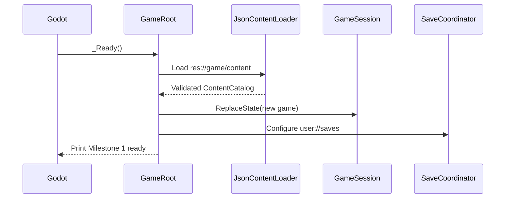

# Milestone 1 guide

Milestone 1 creates the nonvisual application shell that later gameplay will use. It loads
and validates authored content, creates a scene-independent new campaign, and saves or loads
that campaign. It deliberately does **not** add a title screen, movement, combat, inventory
behavior, dialogue, maps, or graphical assets.

## What happens when the project starts



`game/scenes/bootstrap/GameRoot.tscn` is still an empty `Node`, so running the game shows a
blank window. That is expected. The useful result appears in Godot's **Output** panel:

```text
Milestone 1 ready: loaded 15 definitions; new game ... starts at map.prologue.test-room.
```

If content is invalid, startup prints every discovered problem and exits instead of giving
gameplay a partial catalog.

## Content loading and validation

Content starts as one JSON object per file under `game/content/<category>/`. The first folder
selects the C# record type, so an actor file becomes `ActorDefinition`, an item file becomes
`ItemDefinition`, and so on.

The pipeline has four small parts:

1. `IContentSource` supplies raw `ContentDocument` values without deciding what they mean.
2. `DirectoryContentSource` reads normal files for tests and command-line validation.
3. `GodotContentSource` reads `res://` through Godot's virtual filesystem at runtime.
4. `JsonContentLoader` deserializes records, aggregates errors, runs semantic validation,
   and publishes a `ContentCatalog` only when the complete pack succeeds.

`ContentValidator` currently checks:

- supported schema version and canonical, category-correct, globally unique IDs;
- missing references and references to the wrong content category;
- required text and collection values, including explicit JSON `null` mistakes;
- statistic ranges and statistic-valued maps;
- nonnegative prices and ability costs;
- valid loot probabilities and quantity ranges;
- duplicate class unlocks, encounter positions, quest objective IDs, and equipment items;
- stable prefixes for targeting, rulesets, equipment slots, formation slots, music,
  battlefields, objectives, maps, and event flags.

Errors include a file, JSON path, stable error code, and explanation. For example:

```text
actors/aria.json $.startingClassId: Referenced ClassDefinition
'class.missing.vanguard' does not exist. [reference.missing]
```

The catalog indexes definitions by both concrete type and ID. This is valid:

```csharp
ActorDefinition aria = content.GetRequired<ActorDefinition>("actor.hero.aria");
```

Requesting that same string as an `ItemDefinition` fails. The type parameter prevents one
kind of content from silently being used as another.

## The fixture pack

The 15 checked-in records cover every initial category:

| Category | Fixture purpose |
|---|---|
| Statistics | Bounds and dictionary references for HP, MP, strength, defense, and speed |
| Abilities | One hero guard action and one enemy tackle action |
| Class | Aria's Vanguard starting class and level-one ability unlock |
| Actor | The starting actor used by new-game creation |
| Items | A potion and the inventory identity for an iron sword |
| Equipment | Equippable behavior that decorates the iron-sword item |
| Enemy | A green slime with statistics, an ability, and loot |
| Encounter | A two-slime formation with abstract presentation keys |
| Quest | One reach objective, item reward, and completion flag |

These records exist to prove the pipeline and cross-references. They are not a commitment to
final characters, balance, names, or story content.

## New-game creation and persistent session state

`DefaultGameSetup` contains game-specific starting choices: map ID, tile coordinate, facing,
and party actor IDs. `NewGameFactory` is reusable application logic that validates those
choices against the catalog and creates a fresh `GameState`.

The resulting state contains only save-specific facts:

- a unique campaign `SaveId`;
- map ID, tile coordinates, and facing;
- active-party order;
- each actor's current class, level, and experience;
- persistent event flags.

Actor names, base statistics, and class definitions are not copied into the save. They remain
in the content catalog and are found through stable IDs. This avoids bloated saves and makes
balance/content corrections apply consistently.

`GameSession` owns the active `GameState` across future scene transitions. Calling
`ReplaceState` raises `StateChanged`, allowing presentation to refresh without making a scene
or control the authoritative source of campaign data.

## Save and load

`GameRoot` exposes the Milestone 1 use cases future menu controllers can call:

```csharp
root.StartNewGame();
await root.SaveCurrentGameAsync("slot_1");
bool loaded = await root.LoadGameAsync("slot_1");
```

These are application hooks, not a save UI. The logical slot name is restricted to portable
letters, digits, `_`, and `-`, preventing path traversal and invalid filenames.

`SaveCoordinator` wraps `GameState` in a `SaveEnvelope` containing:

- `saveFormatVersion`, which controls compatibility and migrations;
- `gameVersion`, which is diagnostic only;
- `savedAtUtc`;
- the scene-independent campaign `state`.

`SaveJsonSerializer` parses old JSON into a mutable JSON tree, runs every ordered
`ISaveMigration`, and only then deserializes current C# records. This is important because an
old property name or structure may not fit the newest C# type until it has been transformed.

Unknown fields are captured with `JsonExtensionData` and written back. Therefore, adding a
future field does not automatically cause an older build to erase that field during a
load/re-save round trip.

`JsonFileSaveStore` protects an existing save with this sequence:

1. serialize to a unique temporary file beside the destination;
2. read that exact file back and deserialize it for verification;
3. copy the previous primary file to `.bak`, when one exists;
4. move the verified temporary file over the primary file;
5. remove a leftover temporary file if any earlier step fails.

Godot supplies the global path corresponding to `user://saves`. Use Godot's **Open User Data
Folder** command when you want to inspect the actual JSON files; do not hard-code the operating
system's user-data path in game code.

When an export preset is introduced, add `*.json` to its non-resource include filter. Godot's
exported `res://` directory can differ from the editor filesystem, so every release pipeline
must smoke-test the startup content count in an actual exported build.

## Running validation in Visual Studio

Open `RpgGame.sln`, then use **View → Terminal**. From the repository root run:

```powershell
dotnet test tests/RpgGame.Core.Tests/RpgGame.Core.Tests.csproj
dotnet run --project tools/content-validation/RpgGame.ContentValidation.csproj -- game/content
dotnet build RpgGame.sln
```

The first command runs nonvisual xUnit tests. The second validates every content record with
the production loader. The third builds the core library, validator, tests, and Godot C#
assembly.

The key integration test performs the complete milestone flow without opening a Godot scene:

1. load all fixture content;
2. create a new campaign;
3. set an example event flag;
4. write `slot_1.json` in a unique temporary directory;
5. load the slot and compare every current state field;
6. save again and prove `slot_1.json.bak` exists;
7. delete the temporary test directory.

## Adding a content record safely

1. Choose the correct category folder.
2. Copy the field shape from `CONTENT_SCHEMA.md`, not from an unrelated JSON file.
3. Assign a permanent canonical ID. Do not derive identity from the filename.
4. Use IDs for all references and stable game keys.
5. Run the content-validation command.
6. Run the test suite.
7. Commit the JSON and any intentional schema/validation changes together.

## How future save migrations are added

Do not increment `SaveFormatVersion` for a normal additive field with a safe default. For a
breaking change:

1. increment `SaveJsonSerializer.CurrentFormatVersion`;
2. add one immutable migration from the previous integer to the new integer;
3. transform raw `JsonObject` fields and set the new `saveFormatVersion`;
4. register the migration when constructing the serializer;
5. keep an old save fixture and test its meaning after migration;
6. never rewrite an already released migration.

## Boundaries retained for Milestone 2

Milestone 1 stores a starting map ID and tile coordinate but does not create a map or move a
player. It defines ability, item, enemy, encounter, and quest data but does not execute those
systems. Milestone 2 should consume these foundations to build one exploration interaction
slice while keeping `GameState` authoritative and scenes disposable.
