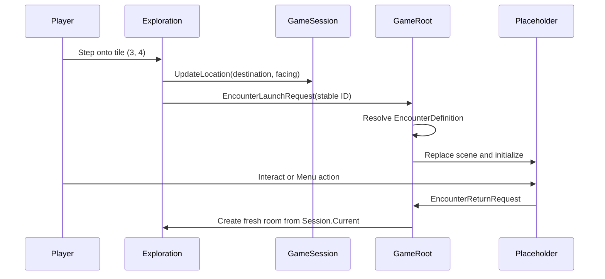

# Milestone 2.5 guide: fixed encounter handoff

> Historical note: this guide documents the original non-combat handoff proof. Milestones 3.14
> and 3.15 replaced the placeholder with a playable battle and persistent victory clearance.
> See `MILESTONE_3_14_GUIDE.md` and `MILESTONE_3_15_GUIDE.md` for current behavior.

Milestone 2.5 proves that exploration can hand control to a second gameplay presentation and
return without making either scene the owner of the campaign. It adds one visible fixed
encounter marker and a temporary information screen. It does **not** simulate a battle.

## What the player can do

James begins at tile `(4, 4)`. The encounter marker is the red diamond immediately to his
left at tile `(3, 4)`. It is a normal walkable floor tile associated with the stable content
ID `encounter.forest.slimes-01`.

Use the current Move Left binding—A or Left Arrow by default—to step onto the diamond. The
game replaces the room with a screen that now displays:

- the Milestone 2.75 formation-foundation label;
- `encounter.forest.slimes-01`;
- both `enemy.forest.green-slime` placements at `formation.enemy.r1.c0` and
  `formation.enemy.r2.c0`;
- every cell in the 4 × 4 enemy and 4 × 2 party grids;
- `battlefield.forest.day`;
- the player's current return bindings.

Use either the current Interact / Confirm action (E, Space, Enter, or Numpad Enter by default)
or Menu / Cancel action (Escape or Tab by default) to return. If those actions were remapped,
the replacement keys work immediately and are shown on the placeholder.

## Transition sequence



The ordering matters. The session receives tile `(3, 4)` before the encounter request, so a
fresh room knows exactly where James belongs when it returns.

## Ownership

| Component | Owns | Does not own |
|---|---|---|
| `TestRoomView` | Marker tile, placeholder drawing, encounter ID lookup | Campaign state or scene changes |
| `ExplorationSceneController` | Accepted movement, session location update, typed launch request | Content loading, combat, or freeing scenes |
| `GameRoot` | Long-lived services and direct replacement of its one active gameplay child | Collision, combat rules, or duplicated campaign fields |
| `BattlePlaceholderController` | Displaying one validated encounter and raising a typed return request | `GameSession`, rewards, victory, flags, or combat |
| `GameSession` | James's authoritative location, party/progress, and event flags | Tiles, Nodes, marker drawing, or current screen |

`EncounterLaunchRequest` and `EncounterReturnRequest` are transient coordination messages.
They contain a stable encounter ID, but they are not saved. There is no active encounter or
pending scene field in `GameState`: merely looking at a placeholder is not campaign progress.
The save format and migrations therefore remain unchanged.

## Why returning does not immediately trigger again

The room asks about an encounter only inside the code path for a **successful step**. Reading
`Session.Current` during construction only places James. The same is true for R reconstruction,
quick-load, and a return from the placeholder. None of those operations pretends that another
step occurred.

After returning, James stands on `(3, 4)` and the placeholder stays closed. Move to any
walkable neighboring tile, then deliberately step back onto `(3, 4)` to request the encounter
again. No cleared flag is set because there is no victory yet.

## How content and controls are reused

The room stores only `encounter.forest.slimes-01`. Before removing exploration, `GameRoot`
calls `IContentCatalog.GetRequired<EncounterDefinition>` for that ID. A pure-core builder
combines the record's anchors with each enemy definition's footprint. The placeholder receives
the resulting placements plus encounter/battlefield IDs; it does not hard-code a separate
slime list or parse slot strings. Startup content validation already proves the enemy IDs,
formation slots, footprint bounds, and overlap rules are legal.

The placeholder uses `GameInputActions.Interact` and `GameInputActions.Menu`, then asks the
same application-lifetime `InputBindingService` used by exploration to format their current
keys. It never reads E, Escape, or another raw return key. Control preferences remain in
`user://settings/controls.json`, separate from every campaign save.

## Complete manual walkthrough

1. Run the project in the matching Godot .NET editor; confirm the test room appears.
2. Walk into a wall and confirm collision still rejects the step.
3. If desired, open Controls with the current Menu action and remap movement or confirmation.
4. Walk to the guide at `(7, 4)`, face it, interact, and confirm the orange guide becomes green.
5. Press R and confirm the room reconstructs with James's location and green guide intact.
6. Press K and confirm the status reports that `slot_1` was saved.
7. Move away, press L, and confirm the saved position/facing/guide flag are restored.
8. Reach `(4, 4)`, then step left onto the red diamond at `(3, 4)`.
9. Confirm the placeholder opens once and shows the encounter ID, battlefield ID, both full
   grids, two slime placements in the enemy front column, and James in party row 0/front.
10. Confirm there are no Attack, Guard, HP, turns, victory, rewards, or other battle controls.
11. Use the currently displayed Interact or Menu binding to return.
12. Confirm James reappears on `(3, 4)` with his existing facing and the guide is still green.
13. Wait without moving and confirm the placeholder does not reopen.
14. Step right to `(4, 4)`, then left onto `(3, 4)` and confirm it opens exactly once again.
15. Return and verify R, K, and L still work in the newly instantiated exploration scene.

The marker can also be reached from any adjacent walkable tile. What matters is that an
accepted movement crosses onto `(3, 4)`; loading or reconstructing while already there must
remain quiet.

## Current limitations

- There is one hard-coded test-room marker, not a reusable map encounter format.
- The placeholder only displays validated formation data and returns.
- It does not build a combat snapshot or mutate `GameState`.
- There is no victory, defeat, reward, escape, encounter clearing, or battle save.
- There are no random encounters, transitions to other maps, scene stack, or general navigator.
- R, K, and L remain temporary fixed development controls available only in exploration.

`MILESTONE_2_75_GUIDE.md` documents the formation model now rendered by this handoff.
Milestone 3 will replace this proof screen with the first deterministic battle slice.

## Validation commands

Run from the repository root:

```powershell
dotnet test tests/RpgGame.Core.Tests/RpgGame.Core.Tests.csproj
dotnet run --project tools/content-validation/RpgGame.ContentValidation.csproj -- game/content
dotnet run --project tools/content-validation/RpgGame.ContentValidation.csproj -- game/content examples/mods
dotnet build RpgGame.sln
godot --headless --editor --path . --quit
```

Use the matching Godot 4.7 .NET executable name if `godot` is not on the system path. After
the automated checks, perform the walkthrough above because input feel and scene presentation
are intentionally verified in the running editor rather than by moving Godot Nodes into Core.
