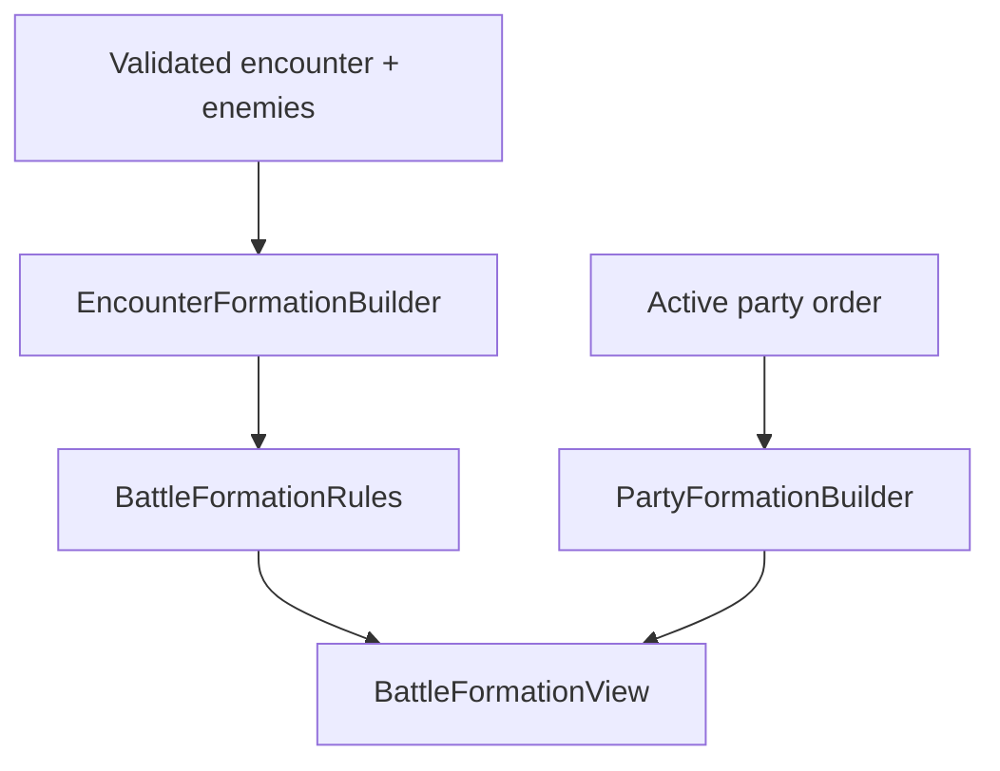

# Milestone 2.75 guide: battle formation foundation

Milestone 2.75 gives the existing non-combat battle placeholder a real, deterministic
formation model. The enemy side has 4 rows × 4 columns, the party side has 4 rows × 2
columns, and both are built from plain .NET values before Godot draws them. There are still
no attacks, HP, turns, targets, victory, rewards, or other combat results.

## What appears in the running game

Step onto the red encounter marker at test-room tile `(3, 4)`. The placeholder shows:

- encounter ID `encounter.forest.slimes-01`;
- battlefield ID `battlefield.forest.day`;
- all 16 enemy cells and all 8 party cells, including empty ones;
- two green-slime instances in enemy rows 1 and 2, front column 0;
- James in party row 0, front column 0;
- each instance ID, definition label, anchor, and enemy footprint;
- the current remappable Interact and Menu bindings used to return.

The enemy grid is drawn on the left and the party grid on the right. Their front columns face
each other across the center gap:

| Enemy rear `c3` | Enemy `c2` | Enemy `c1` | Enemy front `c0` | Gap | Party front `c0` | Party rear `c1` |
|---:|---:|---:|---:|:---:|---:|---:|
| `r0,c3` | `r0,c2` | `r0,c1` | `r0,c0` |  | `r0,c0` | `r0,c1` |
| `r1,c3` | `r1,c2` | `r1,c1` | `r1,c0` |  | `r1,c0` | `r1,c1` |
| `r2,c3` | `r2,c2` | `r2,c1` | `r2,c0` |  | `r2,c0` | `r2,c1` |
| `r3,c3` | `r3,c2` | `r3,c1` | `r3,c0` |  | `r3,c0` | `r3,c1` |

This mirroring is only presentation. Core never knows whether a cell is on the left or right
side of the screen.

## Coordinate convention

Coordinates are zero-based. Rows mean the same thing on both sides:

| Row | Meaning |
|---:|---|
| `0` | Top |
| `1` | Upper-middle |
| `2` | Lower-middle |
| `3` | Bottom |

Columns describe depth relative to that combatant's side:

| Column | Meaning |
|---:|---|
| `0` | Front, closest to opponents |
| `1` | One cell behind the front |
| `2` | Farther behind; enemy side only |
| `3` | Farthest rear; enemy side only |

Column `0` means front for both parties because rules should ask “how deep is this
combatant?” rather than “what screen direction happens to be forward?” Godot mirrors the
enemy visual columns so enemy `c0` and party `c0` are physically nearest each other.

## Anchors and rectangular footprints

An enemy definition owns a rectangular footprint measured in rows × columns. An encounter
owns that enemy's anchor. The anchor is always the **top-front occupied cell**, and the
footprint grows toward increasing row and column values.

A `1 × 1` enemy anchored at `(r1,c0)` occupies only `E`:

| Enemy logical grid | `c0` front | `c1` | `c2` | `c3` rear |
|---|:---:|:---:|:---:|:---:|
| `r0` | · | · | · | · |
| `r1` | **E** | · | · | · |
| `r2` | · | · | · | · |
| `r3` | · | · | · | · |

A `2 × 2` enemy with the same `(r1,c0)` anchor occupies four cells. `A` is the anchor and
`E` marks the rest of the same rectangle:

| Enemy logical grid | `c0` front | `c1` | `c2` | `c3` rear |
|---|:---:|:---:|:---:|:---:|
| `r0` | · | · | · | · |
| `r1` | **A** | **E** | · | · |
| `r2` | **E** | **E** | · | · |
| `r3` | · | · | · | · |

Godot unions those four logical cell rectangles and draws one coherent occupied rectangle
with one label. It does not draw four independent copies of the enemy.

Only rectangles are supported. Irregular masks, rotation, sprite-based collision, and
dynamic footprint changes are deliberately absent.

## Invalid overlap example

Suppose large enemy `A` occupies rows 1–2 and columns 0–1, while small enemy `B` is anchored
at `(r2,c1)`. The `X` cell would belong to both:

| Enemy logical grid | `c0` front | `c1` | `c2` | `c3` rear |
|---|:---:|:---:|:---:|:---:|
| `r0` | · | · | · | · |
| `r1` | A | A | · | · |
| `r2` | A | **X** | · | · |
| `r3` | · | · | · | · |

Content validation reports `formation.overlap` at the later encounter entry's exact
`$.enemyGroup[index].slotId` path and names the conflicting entry/cells. The catalog is not
published, so this cannot become a presentation-time surprise.

## Stable slot IDs

Encounter anchors use exactly:

```text
formation.enemy.r<0-3>.c<0-3>
```

Examples:

```text
formation.enemy.r0.c0
formation.enemy.r1.c2
formation.enemy.r3.c3
```

`FormationSlotId` is the only core parser/formatter. It rejects old abstract values such as
`formation.left`, malformed/case-changed strings, party-side IDs in enemy encounter content,
leading-zero forms, and coordinates outside the 4 × 4 grid. Validators, builders, and views
therefore cannot quietly disagree by implementing separate string parsing.

## Content ownership

The content records answer two different authoring questions:

| Record | Owns | Example |
|---|---|---|
| `EncounterDefinition` | Which enemy participates and its top-front anchor | slime at `formation.enemy.r1.c0` |
| `EnemyDefinition` | Species-wide rectangular footprint | `{ "rows": 1, "columns": 1 }` |

The footprint was additive to enemy schema version `1` when introduced and remains optional
in current enemy schema version `2`:

```json
"formationFootprint": {
  "rows": 2,
  "columns": 2
}
```

Omitting it means `1 × 1`. Explicit `null` is rejected
because it is usually an authoring mistake rather than an intentional default. Neither an
enemy footprint nor an encounter anchor is inferred from a filename, display name, sprite,
or Godot node.

Milestone 2.8 formalizes this content-to-geometry connection, its enemy-specific diagnostics,
and its mod-compatibility tests. The formation dimensions and rectangular geometry continue
to be owned here by the Milestone 2.75 pure rules. See `MILESTONE_2_8_GUIDE.md`.
The later schema-2 change concerns standalone loot tables and does not alter this geometry.

## Runtime ownership and data flow



The responsibilities are intentionally small:

- `EncounterFormationBuilder` preserves authored enemy order, resolves footprints, parses
  anchors, and assigns `enemy-0`, `enemy-1`, and so on.
- `BattleFormationRules` owns dimensions, occupied-cell enumeration, bounds, overlap, and
  duplicate battle-local identity. It is plain .NET and headless-testable.
- `PartyFormationBuilder` places active party index 0–3 into row 0–3, party column 0, using
  one cell each. `PartyRules` remains the owner of the hard four-hero maximum.
- `GameRoot` composes those transient results before replacing exploration.
- `BattleFormationView` converts logical cells to pixels, mirrors the sides, and draws them.
  It does not parse IDs or decide whether a placement is legal.
- `BattlePlaceholderController` displays IDs and listens for the existing remappable return
  actions. It still receives no `IGameSession`.

The formation is not stored in `GameState`. Entering the same encounter deterministically
rebuilds it from content and active-party order. This avoids a save migration and avoids
inventing persistent front/back party choices before there is a real party-formation feature.

## Temporary party placement

For this milestone the party mapping is fixed:

| Active-party index | Battle-local ID | Party cell |
|---:|---|---|
| `0` | `party-0` | `formation.party.r0.c0` |
| `1` | `party-1` | `formation.party.r1.c0` |
| `2` | `party-2` | `formation.party.r2.c0` |
| `3` | `party-3` | `formation.party.r3.c0` |

All party rear-column cells remain visible and empty. This is a deterministic display proof,
not a gameplay bonus or player choice. Persistent front/back selections and a formation menu
wait for an actual use case.

## Validation behavior

Production content validation collects independent problems and publishes no catalog when
any exist:

| Code | Meaning | Typical JSON path |
|---|---|---|
| `formation.slot-invalid` | Encounter anchor is malformed, noncanonical, party-side, or outside 0–3 | `$.enemyGroup[2].slotId` |
| `enemy.footprint-null` | The optional footprint member was explicitly set to null | `$.formationFootprint` |
| `enemy.footprint-rows-invalid` | Rows are outside the enemy formation's 1–4 range | `$.formationFootprint.rows` |
| `enemy.footprint-columns-invalid` | Columns are outside the enemy formation's 1–4 range | `$.formationFootprint.columns` |
| `formation.out-of-bounds` | Valid anchor plus footprint leaves the enemy grid | `$.enemyGroup[0].slotId` |
| `formation.overlap` | Two enemy rectangles claim at least one cell | `$.enemyGroup[1].slotId` |

The pure rule result is presentation-agnostic, while `ContentValidator` translates it into
file/JSON diagnostics. `EncounterFormationBuilder` validates again at its trusted runtime
boundary as a defensive invariant; the Godot scene does not duplicate any rule.

## Data-mod compatibility

Milestone 2.75 raised the supported `gameApiVersion` from `1` to `2`. Version 1 allowed the
documented broad `formation.*` encounter contract; version 2 requires canonical coordinates.
Rejecting API 1 manifests gave mod authors a clear compatibility error instead of guessing
old slot meaning. The current contract is API 3 because Milestone 3.06 later changes enemy
loot authoring; that later change does not alter these formation-coordinate rules.

The save format remains unchanged. Enemy footprints and encounter anchors are definitions,
and battle-local formation placements are reconstructed rather than persisted. See
`MODDING.md` for an authored mod example.

## Complete manual walkthrough

1. Open the project with the matching Godot 4.7 .NET editor and run the main scene.
2. Confirm exploration, wall collision, the guide interaction, and the current controls still
   work. Optionally remap Interact or Menu in the Controls panel.
3. If desired, speak to the guide, press R to reconstruct, press K to save, move, and press L
   to load. Confirm the location and guide flag still restore.
4. Move James to `(4, 4)`, immediately right of the red diamond.
5. Use Move Left to step onto `(3, 4)` and open the placeholder.
6. Confirm the enemy grid contains exactly 4 rows × 4 columns and every empty cell is visible.
7. Confirm the party grid contains exactly 4 rows × 2 columns and every empty cell is visible.
8. Confirm the on-screen arrows make both front columns face the center gap.
9. Confirm `enemy-0` and `enemy-1` each appear once in enemy rows 1 and 2 at front column 0.
10. Confirm `party-0` / James appears once at party row 0, front column 0.
11. Confirm the encounter ID, battlefield ID, anchors, and footprint details are visible.
12. Confirm there are no commands, targets, HP, turns, victory, defeat, or rewards.
13. Return with the displayed Interact or Menu binding, including a remapped key if tested.
14. Confirm James returns on `(3, 4)` and existing campaign flags remain intact.
15. Wait without moving and confirm the encounter does not immediately retrigger.
16. Step off and back onto the marker to confirm deliberate retriggering still works.
17. Return and verify R, K, and L still work in the reconstructed exploration scene.

The automated tests supply valid `2 × 2` placements and prove coherent occupied-cell geometry,
bounds, overlap, and adjacency without adding fake production content. To inspect the visual
rectangle manually, a content author may temporarily use one 2 × 2 enemy in a valid encounter,
run the validator, and open the placeholder; do not commit a meaningless fixture.

## Validation commands

From the repository root:

```powershell
dotnet test tests/RpgGame.Core.Tests/RpgGame.Core.Tests.csproj
dotnet run --project tools/content-validation/RpgGame.ContentValidation.csproj -- game/content
dotnet run --project tools/content-validation/RpgGame.ContentValidation.csproj -- game/content examples/mods
dotnet build RpgGame.sln
& "D:\Godot\Godot_v4.7-stable_mono_win64.exe" --headless --editor --path . --quit
```

Use the actual matching Godot .NET executable path when it is installed elsewhere.

## Deliberately deferred

- attacks, Guard, HP/MP, damage, healing, speed, turns, AI, victory, defeat, and rewards;
- target selection, cursor movement, range, area effects, line of sight, and tactical movement;
- front/back bonuses, blocking, cover, knockback, or forced movement;
- party formation editing, persistent party slots, or formation swapping;
- irregular footprints, rotation, dynamic resizing, or sprite-derived collision;
- battle animation, sprites, audio, and production UI;
- encounter clearing, random encounters, battle saves, and a general navigator.

Milestone 3 can consume these validated placements when it introduces the first narrow combat
state. It should not expand this formation feature into a general-purpose grid engine.
