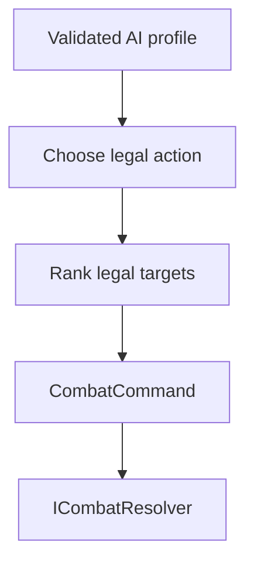

# Milestone 2.85 guide — combat statistic resolution

## Purpose

Milestone 2.85 answers two narrow questions in plain .NET code:

```text
What starting statistic values does this party actor have?
What starting statistic values does this enemy definition have?
```

It does not start a battle. It does not create HP bars, choose targets, process attacks,
or display anything in Godot. Its output is a complete, read-only set of starting values
that a later combat-state factory can copy into a battle snapshot.

## Why the values are derived

The three inputs have different owners and lifetimes:

| Input | Owner | What it means |
|---|---|---|
| `ActorDefinition` | Immutable content catalog | James's intrinsic authored base values |
| `ClassDefinition` | Immutable content catalog | Additive bonuses supplied by one class |
| `ActorProgressState` | One campaign's `GameState` | Which class and level this save currently gives James |
| `EnemyDefinition` | Immutable content catalog | One enemy species' authored starting values |
| `StatisticDefinition` | Immutable content catalog | Stable ID, fallback default, and legal range |

James is not permanently a Vanguard. `ActorProgressState.ClassId` can select Vanguard in one
campaign and Black Mage in another. Saving a duplicate resolved-statistic dictionary would
make those numbers stale whenever the selected class or enabled data content changed. The
game therefore persists the class choice and derives starting combat values when they are
needed.

The result itself is transient. It is not added to `GameState`, `SaveEnvelope`, an actor JSON
record, or a Godot node.

## Party actor formula

For every loaded `StatisticDefinition`, the party formula is exactly:

```text
party statistic =
    actor explicit base value
        or StatisticDefinition.DefaultValue when omitted
    +
    current class explicit bonus
        or zero when omitted
```

The current class always comes from `ActorProgressState.ClassId`. The resolver does not infer
a class from the actor ID, assume Vanguard, read starting-class availability, use the first
loaded class, or look at presentation state.

With the current checked-in content, James as a Vanguard resolves to:

| Statistic | Actor base | Vanguard bonus | Result |
|---|---:|---:|---:|
| `stat.max-hp` | 84 | 12 | 96 |
| `stat.max-mp` | 12 | 0 | 12 |
| `stat.strength` | 9 | 0 | 9 |
| `stat.defense` | 7 | 2 | 9 |
| `stat.speed` | 6 | 0 | 6 |

Changing `ClassId` to Black Mage uses Black Mage's bonuses instead. No actor definition is
rewritten, and no Vanguard special case exists in code.

## Enemy formula

For every loaded `StatisticDefinition`, the enemy formula is exactly:

```text
enemy statistic =
    enemy explicit value
        or StatisticDefinition.DefaultValue when omitted
```

The green slime currently omits `stat.max-mp`, so it receives that statistic's authored
default of `0`. Its level, encounter, formation cell, and footprint do not change the result.
Difficulty multipliers, random variance, and party-level scaling do not exist in this
milestone.

## Complete stable-ID results

`CombatStatisticResolver` asks `IContentCatalog` for every registered
`StatisticDefinition`, sorts those records by ID with `StringComparer.Ordinal`, and adds
exactly one result entry for each. It never maintains a separate list or closed statistic
enum.

That has three useful consequences:

1. Party and enemy results share the same statistic-ID namespace.
2. Enumeration order is deterministic and does not depend on JSON, filesystem, dictionary,
   or mod discovery order.
3. A valid future statistic such as `stat.magic-defense` participates automatically.

A data mod may define a namespaced statistic and use its ID in mod actors, classes, or
enemies. The same resolver handles it without a new `switch` case. Milestone 2.85 adds no JSON
field and does not change the mod data-API or save format.

## Defaults and final range validation

Defaults make a newly registered statistic additive. Existing actors and enemies need not
immediately repeat that key in every record. For a party actor, the class bonus is applied
after the omitted actor value receives the statistic default.

The production content validator checks authored source values. The resolver performs one
additional check on the combined result because two individually legal numbers can still
produce an illegal total:

```text
legal range: 0..100
actor base:   90
class bonus:  20
derived:     110  -> rejected
```

The value is never clamped, wrapped, replaced with a default, or partially published. The
exception identifies the actor, current class, statistic, calculated value, and inclusive
legal range. Enemy results receive the same final range defense.

## Unknown-statistic defense

Normal JSON loading rejects a misspelled or missing statistic reference. The resolver still
checks actor, class, and enemy source dictionaries because a test, editor tool, or future
caller could manually construct an `IContentCatalog` and bypass the production loader.

For example, `stat.magic-defence` must not silently disappear while the resolver iterates
registered definitions. It produces an actionable failure naming the source definition and
unknown ID. This is a trusted runtime-boundary check, not a second general diagnostics system.

## Immutable result ownership

Each resolution creates a new ordinally sorted dictionary and exposes it through
`ReadOnlyDictionary`. The mutable dictionary remains private.

This is stronger than returning a normal `Dictionary` merely typed as
`IReadOnlyDictionary`: a caller cannot cast the result back to a mutable source dictionary
and edit it. Two resolutions are value-equivalent but independently owned, so attempted
mutation cannot alter content, another result, or a later result.

No result is cached because there is no demonstrated performance need, and caching could
complicate ownership when campaign class choices or enabled content differ.

## Level handling

`ActorProgressState.Level` is validated because levels below `1` are invalid campaign data.
Level `1` and higher are accepted, but level and experience do not modify statistics yet.
There is no invented multiplication, growth curve, class growth table, or per-level bonus.

`EnemyDefinition.Level` is likewise retained as authored data but does not scale statistics.
A later progression/balance milestone must define both behaviors from actual game-design
needs.

## Maximum values are not current resources

`stat.max-hp` and `stat.max-mp` describe maximum starting statistics. They are not current
HP or current MP.

Future transient combat state will own mutable values such as:

- current HP and current MP;
- status effects and temporary modifiers;
- Guard state;
- turn and round state.

A future "lowest current HP" selector must query that battle state. A future "lowest maximum
HP" selector may query `stat.max-hp`. A future "lowest HP percentage" selector needs both
current HP and `stat.max-hp`. Adding a mutable `stat.current-hp` content record would mix
definition data with encounter state and is intentionally avoided.

## Future enemy-AI compatibility

The complete stable-ID map preserves a future target-ranking input without implementing any
targeting today. A later validated selector could conceptually receive:

```json
{
  "selectorId": "target.lowest-stat",
  "statisticId": "stat.magic-defense"
}
```

The same code-owned selector could receive `stat.speed` without changing the statistic
resolver. These responsibilities remain separate:



Enemy AI must eventually create the same explicit `CombatCommand` contract as player input.
It must not subtract HP, apply statuses, mutate `GameState`, trigger animations, or bypass
command validation. `ICombatResolver` remains the authority that applies outcomes.

Future programmable AI means a limited set of validated, code-owned behavior primitives with
authored stable IDs and parameters. It does not mean embedded C#, reflection-selected method
names, executable mod assemblies, unrestricted expressions, or a general scripting language.
No AI profile, target selector, command creation, or target tie-breaker is implemented here.

## Why combat snapshot creation is deferred

This milestone produces only immutable starting statistic dictionaries. It does not modify
`CombatSnapshot` or `CombatantSnapshot`, create a combat-state factory, initialize current
HP/MP, or connect the result to the Godot battle placeholder.

That later integration needs real decisions about combatant instance identity, current
resources, commands, and battle lifetime. Keeping it separate makes this calculation easy to
test now without prematurely designing the whole combat system.

## Automated proof

The headless tests cover:

- the exact checked-in James/Vanguard and green-slime values;
- selecting a different class through `ActorProgressState.ClassId`;
- actor and enemy defaults, including a class bonus applied after a default;
- rejection of invalid actor levels, missing/wrong-category content IDs, derived range
  overflow/underflow, and unknown source statistic IDs;
- confirmation that actor and enemy levels do not invent scaling;
- complete ordinal output, equivalent independent resolutions, and blocked mutation;
- automatic party/class/enemy participation by a test-only `stat.magic-defense` definition.

No Godot test is added because the feature has no scene or presentation behavior. The full
solution build and Godot headless import remain integration checks.

## Validation commands

Run from the repository root in PowerShell:

```powershell
dotnet test tests/RpgGame.Core.Tests/RpgGame.Core.Tests.csproj

dotnet run `
    --project tools/content-validation/RpgGame.ContentValidation.csproj `
    -- game/content

dotnet run `
    --project tools/content-validation/RpgGame.ContentValidation.csproj `
    -- game/content examples/mods

dotnet build RpgGame.sln

& "D:\Godot\Godot_v4.7-stable_mono_win64.exe" `
    --headless `
    --editor `
    --path . `
    --quit

if ($LASTEXITCODE -ne 0) {
    throw "Godot validation failed with exit code $LASTEXITCODE"
}
```

Use the actual matching Godot .NET executable path when installed elsewhere. Do not mark the
roadmap milestone implemented or commit until all five commands return exit code `0` and the
manual diff review confirms that the explicitly deferred systems were not introduced.

## Deliberately deferred

- combat snapshot/state construction and current HP/MP;
- Attack, Guard, damage, healing, resource costs, and status effects;
- commands, targeting, legal-target discovery, range, and cursor behavior;
- enemy AI profiles, decision trees, selectors, priorities, and randomness;
- turns, speed ordering, victory, defeat, rewards, and encounter clearing;
- level/experience growth and enemy scaling;
- equipment and temporary modifier pipelines;
- Godot battle presentation and save-format changes.
