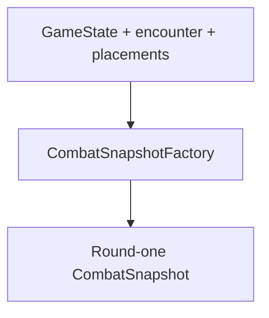

# Milestone 3.0 guide — initial combat state

## Purpose

Milestone 3.0 answers one question in plain .NET:

> Given a campaign, an encounter, and already validated formation placements, what does every
> combatant look like at the instant battle begins?

The result is an immutable `CombatSnapshot`. It contains James and both green-slime
instances, but it does not execute a turn or appear in the running Godot placeholder yet.

## Ownership and lifetime

Three kinds of data meet at this boundary:

| Input | Owner | Example |
|---|---|---|
| Campaign state | `GameState` | James's selected class and level |
| Authored definitions | `IContentCatalog` | actor, class, enemy, encounter, abilities |
| Temporary formation | formation builders | `party-0`, `enemy-0`, anchors, footprints |

`CombatSnapshotFactory` combines them into encounter-lifetime state:



The snapshot is not written into `GameState`, save JSON, content JSON, or a Godot Node.
Destroying it cannot erase campaign progress, and saving the campaign does not attempt to
serialize an unfinished battle.

## Snapshot structure

`CombatSnapshot` currently owns only:

- `Round`, initialized to `1`;
- a read-only ordered collection of `CombatantSnapshot` values.

Each combatant owns:

| Property | Meaning |
|---|---|
| `Placement` | Existing formation identity, side, anchor, and rectangular footprint |
| `Statistics` | Complete resolved statistic map copied into read-only storage |
| `AbilityIds` | Abilities currently available at battle start, in authored order |
| `CurrentHp` | Temporary HP initialized from `stat.max-hp` |

Convenience properties such as `InstanceId`, `DefinitionId`, and `Side` delegate to the
placement. They do not duplicate formation data.

There is deliberately no outcome, current MP, Guard state, status list, command queue, target,
action gauge, or turn owner.

## Current HP versus maximum HP

`stat.max-hp` is a resolved statistic. It describes the combatant's maximum and remains part
of the immutable statistic dictionary.

`CurrentHp` is a separate temporary number. At initialization:

```text
CurrentHp = Statistics["stat.max-hp"]
```

The factory rejects missing, zero, or negative maximum HP. It never substitutes a fallback or
clamps a bad value. A later damage milestone may replace a snapshot with one containing lower
current HP while leaving maximum HP unchanged.

`CombatStatisticIds.MaxHp` is the only code-owned statistic constant added here.
`CombatStatisticResolver` still discovers and resolves every registered statistic
dynamically; the project has not introduced a closed statistic enum.

## Party ability availability

`AbilityAvailabilityResolver` builds one party actor's list in this exact order:

1. `ActorDefinition.StartingAbilityIds`;
2. current `ClassDefinition.AbilityUnlocks` whose `Level` is less than or equal to the
   actor's campaign level.

The resolver preserves authored order, removes duplicates with ordinal comparison while
keeping the first occurrence, and resolves every included ID as an `AbilityDefinition`.

James remains class-neutral. His checked-in actor definition grants no intrinsic ability.
When a test campaign explicitly selects Vanguard at level one, James receives Vanguard's
`ability.vanguard.guard`. A Black Mage James does not receive Guard, and the resolver does
not invent a fallback Attack.

Milestone 3.05 evolves this flat list into a structured party projection with direct Skills
and Magic discipline containers. The compatibility `AbilityIds` view still means the complete
executable ability-ID list.

## Enemy ability availability

An enemy receives `EnemyDefinition.AbilityIds` exactly in authored order. Each ID must
resolve through the content catalog. No ability is selected, no target is chosen, and no
fallback is granted.

An enemy with an empty ability list is still valid initial state. Whether that enemy can take
a legal turn belongs to command and AI milestones, not snapshot construction.

## Identity and deterministic ordering

The formation builders already produce stable battle-local IDs:

```text
party-0
enemy-0
enemy-1
```

These are not content IDs and are not GUIDs. They identify separate instances of the same
enemy definition inside one battle.

The factory preserves:

1. party placements in supplied order;
2. enemy placements in supplied order.

It rejects duplicate instance IDs across both sides. `FormationPlacement` remains
authoritative for side, anchor, and footprint, so the snapshot cannot disagree with formation
geometry.

## Defensive checks

The factory fails clearly instead of silently skipping malformed data. It checks:

- null arguments and null manually constructed collections;
- wrong formation side;
- actor/enemy content category mismatches;
- enemy placement identity versus the encounter entry;
- active-party membership;
- exactly one matching `ActorProgressState` by stable actor ID;
- duplicate battle-local instance IDs;
- missing ability references;
- missing or nonpositive `stat.max-hp`;
- existing formation bounds and overlap rules.

Normal JSON loading prevents most of these cases. The checks still matter because unit tests
and future tools can construct an `IContentCatalog` directly.

## Immutable collection ownership

A read-only interface alone is not enough if it wraps a caller-owned mutable list.
Constructors therefore copy statistics, abilities, and combatants before exposing read-only
wrappers.

As a result:

- casting the returned collections to mutable interfaces and editing them throws;
- editing an enemy definition after snapshot creation does not change that snapshot;
- two independently built snapshots contain equivalent values but do not share their mutable
  backing collections.

No external immutable-collections package was added.

## Running-game behavior

Milestone 3.0 is headless foundation only. The Godot project intentionally still opens the
Milestone 2.75 formation placeholder when James steps on the encounter marker. That screen does
not construct or display this snapshot.

A later ticket will decide how the battle scene receives a snapshot. This milestone makes no
change to `GameRoot`, encounter return behavior, save state, content schema, or mod API.

## Automated coverage

The focused tests describe:

- the fixed `party-0`, `enemy-0`, `enemy-1` identity and ordering;
- formation preservation;
- James and both slimes starting at maximum HP;
- eligible, future, ordered, and duplicate party abilities;
- authored enemy ability order and valid empty lists;
- wrong side/category, duplicate identity, missing/duplicate progress, inactive actor,
  missing ability, null collection, and maximum-HP failures;
- immutable and independently owned snapshot collections.

## Local validation

Run these from the repository root after installing the review update:

```powershell
dotnet test tests/RpgGame.Core.Tests/RpgGame.Core.Tests.csproj

dotnet run `
    --project tools/content-validation/RpgGame.ContentValidation.csproj `
    -- game/content

dotnet run `
    --project tools/content-validation/RpgGame.ContentValidation.csproj `
    -- game/content examples/mods

dotnet build RpgGame.sln

& "D:\Godot\Godot_v4.7-stable_mono_win64.exe" `
    --headless `
    --editor `
    --path . `
    --quit

if ($LASTEXITCODE -ne 0) {
    throw "Godot validation failed with exit code $LASTEXITCODE"
}
```

All five commands must return exit code `0` before the milestone is committed.

## Deferred scope

Milestone 3.0 does not implement:

- Attack content, damage, healing, or HP changes after initialization;
- targeting, command validation, Guard execution, enemy AI, or speed ordering;
- turns, victory, defeat, rewards, encounter clearing, or campaign result handling;
- current MP, costs, statuses, equipment, or progression formulas;
- Skill/Magic/Hybrid categories, magic schools, or ability-combination recipes;
- Godot battle UI or changes to the existing placeholder;
- save migrations or battle saves.
