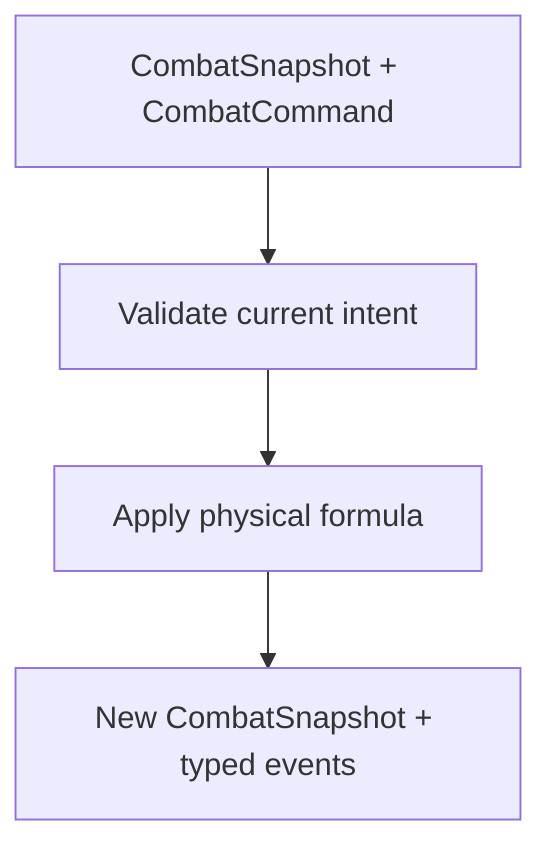

# Milestone 3.10 guide — single-action physical combat

## What this milestone proves

Milestone 3.10 proves one complete combat action entirely in plain .NET:



There is still no battle menu, turn loop, or enemy AI. Tests submit an explicit command so the
core rule can be reviewed before Godot presentation is allowed to depend on it.
Milestone 3.12 now composes this unchanged single-action rule into deterministic complete
rounds; see `MILESTONE_3_12_GUIDE.md` for command collection, ordering, and enemy planning.

## The important HP correction

`CombatantSnapshot` is reusable runtime state, not only a battle-start DTO. Runtime current HP
must therefore allow:

```text
0 <= CurrentHp <= MaximumHp
```

Zero means `IsDefeated == true`. Negative HP and HP above the resolved maximum remain invalid.

`CombatSnapshotFactory` has a different responsibility: it creates the initial battle state.
It still requires a positive `stat.max-hp` and initializes `CurrentHp` to that positive value.
Keeping these rules separate lets later damage represent defeat without allowing a combatant
to begin a normal encounter already defeated.

`CombatantSnapshot.WithCurrentHp` is the safe replacement helper. It preserves placement,
statistics, flat enemy abilities, and structured party Skill/Magic availability while applying
the runtime HP invariant.

## Why Attack belongs to James

The base record `ability.command.attack` is a direct Skill using:

| Field | Value |
|---|---|
| Target | `target.enemy.single` |
| Ruleset | `rules.damage.physical` |
| Damage type | `damage-type.slash` |
| Cost | none |
| `power` | `4` |

James lists Attack in `startingAbilityIds`. This makes it intrinsic to the hero regardless of
whether the campaign chooses Vanguard, Black Mage, or White Mage. James remains class-neutral,
and all current vanilla classes deliberately have empty `abilityUnlocks` arrays. Class skills
can be authored later without changing the actor or resolver.

This arrangement is also data-driven. Another authored actor may have a different intrinsic
command list, and a mod-owned actor/class can reference any supported ability contract under
the existing namespace rules.

## Command validation

`CombatCommand` names battle-local instances, not content records or node paths:

```csharp
var command = new CombatCommand(
    "party-0",
    "ability.command.attack",
    ["enemy-0"]);
```

Before calculating damage, `CombatResolver` checks:

1. the acting instance exists and is alive;
2. its snapshot lists the selected executable ability;
3. the ability exists in the validated content catalog;
4. it declares a supported cost and the actor can afford it;
5. exactly one target was supplied;
6. the target exists, is alive, and is on the opposing side;
7. the ability uses the supported `target.enemy.single` and
   `rules.damage.physical` combination.

An invalid command raises `CombatCommandValidationException`. Its stable `ProblemCode` is for
program decisions; its message is for a developer or log. A future UI should normally prevent
invalid choices, but the core still validates because a menu can become stale after state
changes and future enemy AI will submit the same command type.

Malformed published content or impossible snapshot structure is different from invalid player
intent and continues to raise a data/invariant exception.

## Physical damage

The implemented deterministic formula is:

```text
rawDamage = max(1, attacker Strength + authored power - defender Defense)
typedDamage = modifier == -100
    ? 0
    : max(1, floor(rawDamage * (100 + modifier) / 100))
roundedDamage = typedDamage
appliedDamage = min(roundedDamage, target CurrentHp)
nextHp = target CurrentHp - appliedDamage
```

Authored numeric parameters use `decimal`, while HP is integer. Flooring is explicit so the
same fractional-power and percentage-affinity content produces the same integer result on every
platform. A modifier of `-100` is immunity; any other modifier preserves a one-damage minimum.
The final clamp means HP reaches zero but never becomes negative, and `DamageApplied.Amount`
reports only the HP actually removed. Milestone 4.3 adds this typed percentage step without
changing command legality or snapshot lifetime; see `MILESTONE_4_3_GUIDE.md`.

The current formula has no randomness, critical hits, active equipment modifiers, row bonuses,
variance, or level scaling. Those mechanics should be added only through later gameplay
decisions and focused tests.

## Immutable result and event order

The resolver never mutates the input snapshot. It copies the ordered combatant collection,
replaces exactly the damaged target, and constructs a new `CombatSnapshot` with the same round.
Formation placement, statistics, abilities, party Magic structure, unrelated combatant HP, and
instance order are preserved.

Successful nonlethal damage emits one event:

```text
DamageApplied
```

Lethal damage emits these facts in order:

```text
DamageApplied
CombatantDefeated
```

Milestone 3.13 extends that order only when the target was the final living member of its side:

```text
DamageApplied
CombatantDefeated
BattleEnded
```

Godot presentation can animate those facts later without recalculating damage. Defeating a
nonfinal combatant still emits no `BattleEnded`; see `MILESTONE_3_13_GUIDE.md`.

## Compatibility

- No save fields or save migration were added; combat snapshots remain transient.
- Milestone 4.3 later added optional content fields without changing schema versions or the mod
  data-API; omitted legacy damage ability types resolve as Energy.
- Existing saves gain James's intrinsic Attack when content is resolved, just as other authored
  actor/class abilities are resolved from the current catalog.
- Vanilla classes currently grant no abilities. The generic class-unlock and defensive
  authoring contracts remain available for later content, but this resolver executes only the
  physical-damage contract documented above.
- Cost-bearing abilities remain unsupported because `stat.max-mp` is a maximum statistic, not
  mutable current MP.

## Automated coverage

Focused tests prove:

- zero runtime HP is valid and reports defeated;
- negative HP and HP above maximum are rejected;
- initial snapshot creation still begins at positive maximum HP;
- Attack follows the formula, damage type, signed affinity percentage, minimum, immunity,
  decimal rounding, remaining-HP clamp, and defeat event;
- party and enemy physical abilities can target the opposing side;
- missing/defeated actors, unowned/missing abilities, invalid target counts, missing/defeated/
  same-side targets, unsupported contracts, and costs are rejected with stable codes;
- the input, unrelated combatants, ordering, formation, round, statistics, and abilities remain
  unchanged;
- command and resolution collections cannot be mutated through caller-owned lists.

## Local validation

Run these commands from the repository root in PowerShell, stopping after any failure:

```powershell
dotnet test tests/RpgGame.Core.Tests/RpgGame.Core.Tests.csproj

dotnet run `
    --project tools/content-validation/RpgGame.ContentValidation.csproj `
    -- game/content

dotnet run `
    --project tools/content-validation/RpgGame.ContentValidation.csproj `
    -- game/content examples/mods

dotnet build RpgGame.sln

& "D:\Godot\Godot_v4.7-stable_mono_win64.exe" `
    --headless `
    --editor `
    --path . `
    --quit

if ($LASTEXITCODE -ne 0) {
    throw "Godot validation failed with exit code $LASTEXITCODE"
}
```

Every command must return exit code `0`. The Godot check proves integration/import health; no
new visible battle behavior is expected when running the game.

## Explicitly deferred

- Guard execution and defensive state;
- additional action effects beyond the implemented physical-damage contract;
- items, status effects, and resource families beyond current MP;
- campaign outcome application, encounter clearing, experience, loot rolls, and rewards;
- campaign-state changes and battle saves;
- Godot battle menus, targeting UI, animation, sound, and event presentation.

Complete deterministic rounds and the basic enemy planner now exist in Milestone 3.12, while
Milestone 3.13 adds the battle-local outcome. They compose this resolver without making it own
UI, campaign, or reward behavior.
