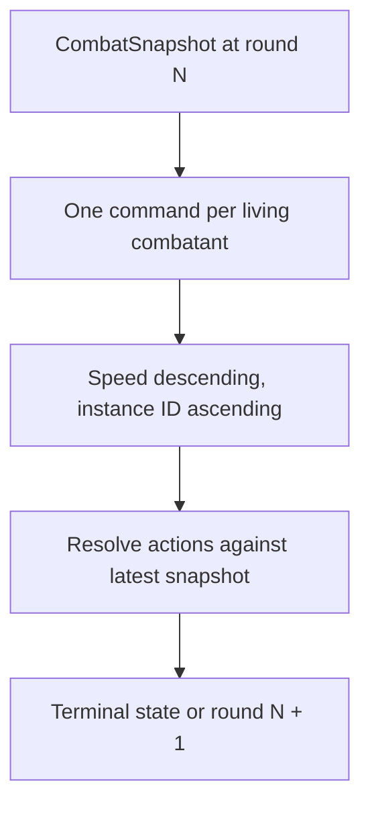

# Milestone 3.12 guide — complete deterministic rounds

## What this milestone proves

Milestone 3.10 proved one action. Milestone 3.12 proves that several ordinary actions can be
collected and resolved as one deterministic round without putting a turn loop in Godot:



At the time of this milestone, it did not add a battle screen. The Godot formation placeholder
remained unchanged and all new behavior lived in plain .NET. Milestone 3.14 now supplies the
command collector; the pure round rules documented here remain the sole owner of ordering and
resolution.

## Who owns each decision

| Decision | Owner |
|---|---|
| Which command a party member chooses | Future player command UI/coordinator |
| Which command an enemy chooses | `EnemyCommandPlanner` |
| Whether the command itself is legal | `CombatResolver` |
| Damage and immutable state replacement | `CombatResolver` |
| Complete command coverage and action order | `CombatRoundResolver` |
| Animation, menus, and event playback | Future Godot presentation |
| Campaign rewards and encounter clearing | Deferred application milestone |

The round resolver receives commands from both sides. It does not call the enemy planner
itself. A later battle coordinator can therefore gather player choices and AI choices through
different mechanisms, then submit one uniform command list.

## Complete command collection

Every combatant alive in the starting snapshot must submit exactly one `CombatCommand`.
Combatants already at zero HP must submit none. The collection is rejected before ordering if
an actor is missing, defeated at round start, duplicated, or omitted.

```csharp
var enemyPlanner = new EnemyCommandPlanner(content);
IReadOnlyList<CombatCommand> commands =
[
    new CombatCommand("party-0", "ability.command.attack", ["enemy-0"]),
    enemyPlanner.Plan(snapshot, "enemy-0"),
    enemyPlanner.Plan(snapshot, "enemy-1"),
];

var rounds = new CombatRoundResolver(new CombatResolver(content));
CombatResolution result = rounds.ResolveRound(snapshot, commands);
```

The caller's list order is not initiative order. Changing the list order cannot change the
result.

## Deterministic action order

Each command captures its actor's resolved `stat.speed` from the starting snapshot. Commands
then sort by:

1. higher Speed first;
2. ordinal `ActingCombatantId` ascending when Speed is equal.

For example, equal-Speed IDs act in this order:

```text
enemy-0
enemy-1
party-0
```

The explicit ordinal tie-break prevents platform culture, dictionary order, formation drawing
order, or JSON discovery order from changing combat.

## Resolving against the newest state

Commands are collected once, but actions execute sequentially against the newest immutable
snapshot. After every action, the round coordinator carries forward the returned state and
appends its typed events in execution order.

Before a pending action executes, the coordinator rereads its actor. If a faster action reduced
that actor to zero HP, the pending action is skipped. If an action defeats the final living
combatant on either side, the round stops immediately and no later command executes.

Commands are not automatically retargeted. If a selected target becomes invalid while its side
still has other living members, the existing command validator rejects that stale command.
Retarget-versus-fizzle behavior is a player-facing design decision intentionally deferred
until multiple controllable party members and a real battle menu exist.

## Round-number meaning

`CombatSnapshot.Round` means the round currently accepting/resolving commands.

- If both sides survive every action, round `N` returns a snapshot for round `N + 1`.
- If one side is defeated, the result stays at round `N` because no next round begins.
- Calling `ResolveRound` on an already terminal snapshot is rejected.

There is no separate round-advance command, transient-effect cleanup phase, or round event.
The existing action events remain in exact action order. Milestone 3.13 now appends a typed
`BattleEnded` event when an action defeats a side; see `MILESTONE_3_13_GUIDE.md`.

## Basic enemy planner

For one living enemy, `EnemyCommandPlanner`:

1. scans `AbilityIds` in authored order;
2. skips abilities with unsupported costs, insufficient current MP, or target/ruleset contracts;
3. selects the first ability the current resolver can execute;
4. finds the living party member with the lowest absolute `CurrentHp`;
5. breaks equal-HP ties with ordinal instance ID;
6. returns a normal `CombatCommand`.

It does not rank percentage HP, predict damage, inspect class names, use formation distance,
or read display text. A missing content reference is treated as malformed published state. A
living enemy with no currently executable ability raises an actionable planning exception
instead of silently inventing Attack or passing its turn.

`CombatAbilityExecutionSupport` is an internal shared predicate used by the action resolver and
planner. It contains only the currently executable free physical contract. When a future
ruleset becomes real, its resolver behavior, shared support check, planner tests, and
documentation must change together.

## Compatibility and deliberate limits

- No content schema or mod data-API version changed.
- No save field or migration changed; combat snapshots and round commands remain transient.
- Attack remains intrinsic to James, and Tackle remains owned by the green slime.
- Every vanilla class still has an empty `abilityUnlocks` array.
- No random source is consumed, so identical snapshots and commands produce identical results.

Explicitly deferred: Godot command UI, party input collection, automatic retargeting, class
skills, advanced AI profiles, status effects, campaign victory/reward application,
encounter clearing, loot rolls, battle saves, animation, and sound.

## Automated coverage

Focused tests prove:

- caller command order does not affect initiative;
- Speed descending and ordinal instance-ID ties are deterministic;
- a combatant defeated before its action is skipped;
- defeating the final member of either side stops later actions;
- terminal rounds preserve the typed `PartyVictory` or `PartyDefeat` outcome and end event;
- only nonterminal results advance the round number;
- missing, duplicate, unknown, and initially defeated command actors are rejected;
- the checked-in slime plans Tackle as an ordinary command;
- unsupported abilities are skipped during planning;
- lowest-current-HP targeting and ID ties are deterministic;
- a planner with no usable ability or living target fails explicitly.

## Local validation

Run from the repository root in PowerShell:

```powershell
dotnet test tests/RpgGame.Core.Tests/RpgGame.Core.Tests.csproj

dotnet run `
    --project tools/content-validation/RpgGame.ContentValidation.csproj `
    -- game/content

dotnet run `
    --project tools/content-validation/RpgGame.ContentValidation.csproj `
    -- game/content examples/mods

dotnet build RpgGame.sln

& "D:\Godot\Godot_v4.7-stable_mono_win64.exe" `
    --headless `
    --editor `
    --path . `
    --quit

if ($LASTEXITCODE -ne 0) {
    throw "Godot validation failed with exit code $LASTEXITCODE"
}
```
