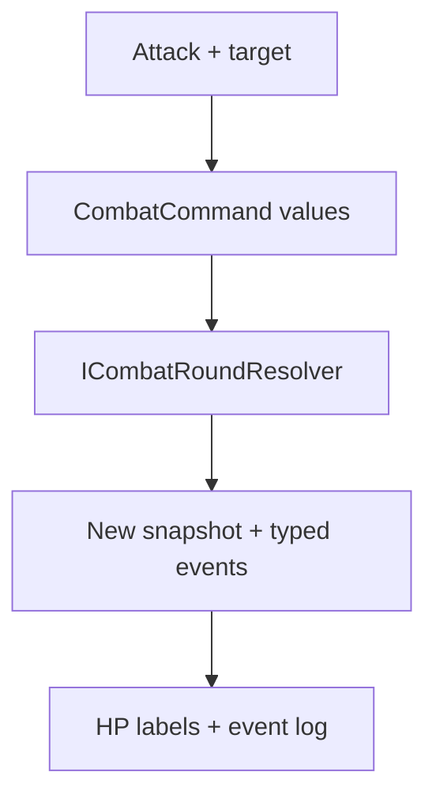

# Milestone 3.14 guide — playable Godot battle

## What the player can do

The red diamond at test-room tile `(3, 4)` now opens a small playable battle instead of a
return-only formation proof. The battle contains James and the two green slimes already defined
by `encounter.forest.slimes-01`.

The loop is deliberately small:

1. Choose **Attack**.
2. Choose one living slime.
3. The core resolves James and every living slime in deterministic Speed order.
4. Read the HP displays and event log.
5. Repeat until the core reports victory or defeat.
6. Confirm the result to return to exploration.

There is no Guard command. Guard was deliberately removed and this milestone does not recreate
its content, runtime state, events, round behavior, or UI.

## Which layer owns each decision

| Concern | Owner | Why |
|---|---|---|
| Attack button, focus, target buttons, HP labels, log text | `BattleController` in `Rpg.Game` | These are Godot presentation concerns. |
| Damage, HP replacement, defeated actors | `CombatResolver` in `Rpg.Core` | Rules remain deterministic and headless-testable. |
| Speed ordering, skipped defeated actors, round advancement | `CombatRoundResolver` in `Rpg.Core` | UI collection order must never change simulation order. |
| Slime ability and target intent | `EnemyCommandPlanner` in `Rpg.Core` | Enemy and player actions use ordinary `CombatCommand` values. |
| Victory or defeat | `CombatSnapshot.Outcome` and `BattleEnded` | The UI must not infer an outcome from its labels. |
| Encounter clearance | Not the battle scene | Campaign handoff belongs to Milestone 3.15 and `GameRoot`. |

The most important boundary is that the scene never writes HP. It submits commands and replaces
its local snapshot only with `CombatResolution.Next`:

If the formula changes later, this screen does not change. It already reads the authoritative
`DamageApplied` amount and before/after HP values from core events.

## Stable identity versus display text

Commands target battle-local instance IDs such as `party-0`, `enemy-0`, and `enemy-1`. Content
continues to use stable IDs such as `ability.command.attack` and
`enemy.forest.green-slime`. Friendly labels such as `James`, `Green Slime #1`, and
`Green Slime #2` are presentation only; they are never used to locate a combatant or saved.

`BattleFormationView` owns one label map so the formation, HP rows, target buttons, and event log
use consistent occurrence numbering. That avoids the earlier confusing raw `enemy-0` label
without weakening stable identity.

## Input behavior

- Mouse: click **Attack**, then click a living enemy.
- Keyboard: use the current Interact / Confirm action to open Attack and confirm a target.
- Use current movement actions to cycle targets.
- Use current Menu / Cancel while choosing a target to return to the command step.
- Confirm once more after the terminal result to leave battle.

All of these use the existing `InputBindingService`; no hard-coded E, Space, arrow, or WASD
checks were added to battle gameplay. Controller support is still deferred.

## Events shown in the log

The presenter intentionally handles the complete event set supported by the current resolver:

| Event | Presentation |
|---|---|
| `DamageApplied` | Actor, ability, target, applied damage, and authoritative HP transition |
| `CombatantDefeated` | A defeated message for that battle-local combatant |
| `BattleEnded` | Party victory or party defeat |

An unknown event currently throws instead of silently disappearing. When a future milestone
adds a real event—such as healing or a status application—it must deliberately add its battle
presentation at the same time.

## Manual review

1. Run the project and step left from `(4, 4)` onto the red encounter marker.
2. Confirm the battle displays James and two numbered green slimes without overlapping labels.
3. Confirm every combatant has current/maximum HP.
4. Click Attack, select slime #2, and confirm the event log names the selected target.
5. Confirm James and living enemies act, HP changes, and the next round number appears.
6. Confirm a defeated slime becomes disabled and cannot be selected again.
7. Continue until Victory, then confirm the Continue button appears only after battle ends.
8. Confirm there is no Guard command anywhere in the battle.

The fixed base-content balance is expected to produce a party victory. The same controller has
an explicit PartyDefeat confirmation path driven by `CombatSnapshot.Outcome`; pure-core tests
exercise defeat deterministically without adding a debug loss button or changing game balance
solely for manual testing.

## Deliberately deferred

- Guard, class abilities, magic, items, escape, or command queues for multiple party members;
- resource costs/current MP, statuses, healing, area targets, or retargeting;
- animation, sprites, sound, floating numbers, and polished battle UI;
- rewards, loot resolution, experience, gold, or inventory mutation;
- saving/resuming a transient battle and controller navigation.
