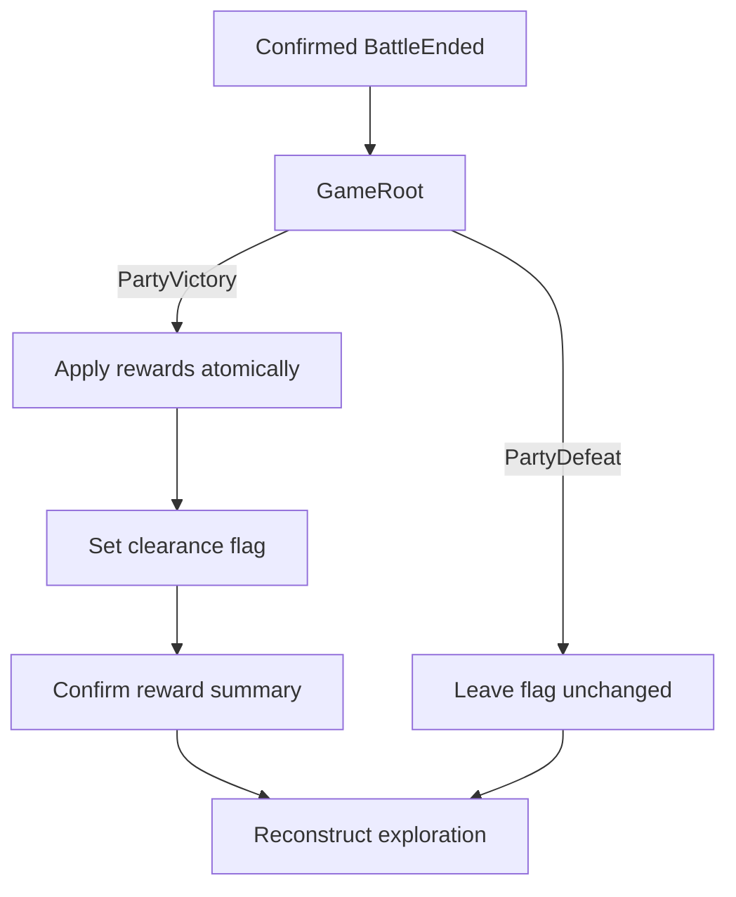

# Milestone 3.15 guide — campaign handoff

## What becomes persistent

The fixed test-room encounter now has one stable campaign fact:

```text
flag.encounter.forest.slimes-01.cleared
```

An absent or false flag means the encounter is available. A true flag means the party has won
and the room must not draw or trigger its marker. This flag is ordinary `GameState.EventFlags`
data, so the existing save serializer already preserves it; no save-format change or migration
is needed.

The transient combat snapshot is still not saved. Current battle HP, round number, pending
commands, and event-log text disappear when the battle scene is freed.

## Victory and defeat flow

The battle scene raises a typed `BattleCompletionRequest` only after the player confirms a core
terminal outcome. It contains the stable encounter ID, `BattleOutcome`, and defeated enemy
definition IDs derived in final snapshot order, not scene paths, display labels, or arbitrary
result strings.



`TestRoomEncounterProgress` is a small game-specific mapping for this one real encounter. It is
not a generic quest system or encounter manager. `GameRoot` owns the transition because it
already owns application services and the lifetime of the three current presentations.
`BattleController` deliberately receives no session service and therefore cannot accidentally
mutate campaign progress. Milestone 4.2 sets clearance only after atomic reward application;
failure leaves both inventory and the flag unchanged.

## Why the encounter cannot retrigger after victory

There are two checks:

1. `ExplorationSceneController` reads the clearance flag whenever authoritative state is
   applied and tells `TestRoomView` whether the marker is cleared.
2. `GameRoot` checks the flag again before constructing battle, protecting against a stale or
   duplicated launch request.

When cleared, `TestRoomView` both hides the red diamond and refuses its encounter lookup. The
room node is disposable; reconstructing it with R or replacing state through L derives the same
result from `GameState`.

After defeat, no flag is written. James returns standing on the marker, but reconstruction does
not pretend he took a new step, so battle does not immediately reopen. Step onto a neighboring
walkable tile and then back onto `(3, 4)` to retry deliberately.

## Save/load proof

The save test now writes the exact encounter-clearance flag, saves through the production
coordinator, loads it, and verifies the value is still true. Existing event-flag serialization
already uses named fields and preserves future unknown fields, so this addition does not change:

- save format version;
- `GameState` schema version;
- save migrations;
- mod data-API version;
- content records.

Manual proof after a victory:

1. Confirm the victory result and verify the reward summary appears before the test room.
2. Confirm the summary and verify the room returns with no red diamond.
3. Press R and verify reconstruction does not restore the marker or reapply rewards.
4. Press K to save the cleared campaign to `slot_1`.
5. Start or load a state where the marker is present if you want a visible contrast.
6. Press L and verify the saved cleared state hides the marker again.
7. Walk across `(3, 4)` and verify battle does not retrigger.

Loading an older save made before victory correctly restores that older save's uncleared state.
Save/load preserves the saved campaign; it does not merge progress from a newer in-memory state.

## Deliberately deferred

- generic encounter-progress definitions or map encounter tables;
- random encounters, respawning enemies, multiple maps, or scene navigation infrastructure;
- experience, gold, quest rewards, or reward autosave;
- battle save/resume and persistence of damage taken inside a battle;
- victory animation, defeat penalties, checkpoints, or game-over screens.
