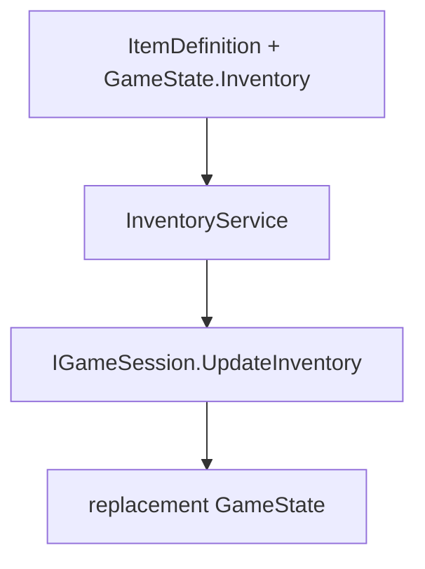

# Milestone 4.0 guide - persistent inventory stacks

## What this milestone adds

Milestone 4.0 gives each campaign one persistent inventory without adding reward or item-use
gameplay. The authoritative representation is:

```text
GameState.Inventory: stable item definition ID -> owned quantity
```

Each item ID appears once. Missing means zero, stored quantities are positive, and the
matching `ItemDefinition.MaxStack` is the inclusive upper bound. Player-selected ordering,
slot indexes, duplicate stacks, display names, definitions, files, and Godot resources are not
saved.

## Ownership and flow

`GameState` owns quantities because inventory must survive scene replacement and save/load.
`ItemDefinition` remains immutable application-lifetime content. `InventoryService` combines
those two sources through narrow dependencies and publishes accepted changes through the
session:



The service is plain .NET in `Rpg.Core`. It is not a Godot autoload or unrestricted singleton.
`GameSession` does not receive the content catalog and therefore does not own category or
maximum-stack validation.

## New-game behavior

`NewGameFactory` explicitly creates an empty ordinal inventory. James receives no starting
items. Actor and class content do not gain starting-inventory fields.

## Queries and mutations

`GetQuantity` resolves the requested ID as an `ItemDefinition` and returns zero when that valid
item has no stack.

`AddItems` accepts an ordered collection of positive item additions. It validates the complete
batch and current inventory, resolves every item, combines duplicate IDs in first-occurrence
order, uses checked arithmetic, and rejects any final quantity above `MaxStack`. It builds the
complete replacement before one `UpdateInventory` call, so an invalid later award cannot publish
an earlier one. An empty batch is a no-op. `AddItem` delegates to this same path.

Neither addition API clamps, discards overflow, partially applies a request, or creates another
stack. Capacity errors report the item ID, current quantity, requested quantity, and maximum
stack.

`RemoveItem` also requires a resolved item and positive request. It rejects absent items and
requests larger than the owned quantity. A partial removal stores the remaining positive
quantity; an exact removal deletes the key so zero quantities never remain.

Before either mutation, every current entry must have a nonblank ID that resolves to an
`ItemDefinition`, and a quantity from one through that definition's `MaxStack`. Malformed
manually constructed state fails clearly and is never silently repaired.

## Replacement state and notifications

Mutations copy the current inventory with `StringComparer.Ordinal`; they never edit
`session.Current.Inventory` in place. `IGameSession.UpdateInventory` copies its input again,
rejects blank IDs and nonpositive values, and compares key/value pairs rather than dictionary
identity.

A real successful change publishes one replacement `GameState` and raises `StateChanged`
exactly once. Save identity, location, active-party order, actor progress, event flags, and
extension data remain unchanged. A failed operation publishes nothing, and a logically
identical inventory update is a no-op. Retaining and mutating the caller's source dictionary
cannot mutate authoritative session state.

## Persistence and compatibility

Inventory participates in the existing `System.Text.Json` save pipeline as a normal
`GameState` field. Current saves write the dictionary and save/load preserves quantities.
The property has an empty default, so older JSON that omits `inventory` loads as an empty
inventory. Existing `JsonExtensionData` continues to preserve unknown future state fields.

This is an additive field with a safe default under the policy in `MILESTONE_1_GUIDE.md`.
`SaveJsonSerializer.CurrentFormatVersion` and `GameState.SchemaVersion` therefore remain `1`,
and no save migration is added. Item definitions, content schemas, and mod data API 3 are
unchanged. A valid item owned by an enabled data mod can be stored by its stable namespaced ID
when that item is present in the resolved catalog.

## Relationship to loot tables

Loot tables reference item definitions and describe possible quantities. Milestone 4.1 resolves
those independent rolls into transient typed awards without mutating campaign state. Milestone
4.2 now converts accepted victory awards to one atomic `AddItems` batch and shows separately
aggregated presentation totals.

## Automated coverage

Focused headless tests cover empty new games, quantity queries, new and existing stacks,
single and batch additions, duplicate aggregation/order, maximum boundaries, checked overflow,
invalid-later rollback, add/remove atomicity, malformed current inventory, notification counts,
unrelated-state preservation, defensive session copies, logical no-op updates, save
compatibility, unknown future fields, and mod-owned item IDs.

## Local validation

Run these commands from the repository root in PowerShell:

```powershell
dotnet test tests/RpgGame.Core.Tests/RpgGame.Core.Tests.csproj

dotnet run `
    --project tools/content-validation/RpgGame.ContentValidation.csproj `
    -- game/content

dotnet run `
    --project tools/content-validation/RpgGame.ContentValidation.csproj `
    -- game/content examples/mods

dotnet build RpgGame.sln

& "D:\Godot\Godot_v4.7-stable_mono_win64.exe" `
    --headless `
    --editor `
    --path . `
    --quit

if ($LASTEXITCODE -ne 0) {
    throw "Godot validation failed with exit code $LASTEXITCODE"
}
```

## Deferred scope

Milestone 4.0's inventory boundary still excludes item use, healing or battle items, equipment
ownership and equipping, shops, buying or selling, gold, experience rewards, key-item rules,
sorting, discard confirmation, storage boxes, and inventory-menu presentation. Victory reward
composition is documented separately in `MILESTONE_4_2_GUIDE.md`.
